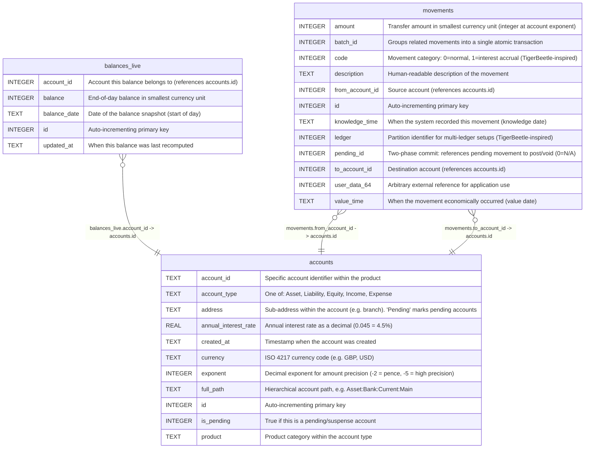

# go-luca

## Description

Movement-based double-entry bookkeeping database schema

## Tables

| Name                              | Columns | Comment                                                                                                                                                                                                                                                                          | Type  |
| --------------------------------- | ------- | -------------------------------------------------------------------------------------------------------------------------------------------------------------------------------------------------------------------------------------------------------------------------------- | ----- |
| [accounts](accounts.md)           | 11      | Chart of accounts. Each account has a hierarchical path (Type:Product:AccountID:Address) and belongs to one of five fundamental types: Asset, Liability, Equity, Income, Expense. Amounts are stored as integers at the precision defined by exponent (e.g. -2 for pence).  | table |
| [balances_live](balances_live.md) | 5       | Pre-computed end-of-day balance snapshots. Updated transactionally when movements are recorded via RecordMovementWithProjections. Avoids expensive SUM queries for frequently accessed balances.                                                                            | table |
| [movements](movements.md)         | 12      | Core transaction records. Each movement transfers an integer amount from one account to another. Movements with the same batch_id form a linked transaction (compound entry). Inspired by TigerBeetle's transfer model with code, ledger, and pending_id fields.            | table |

## Relations

---

> Generated by [tbls](https://github.com/k1LoW/tbls)
