# go-luca

## Description

Movement-based double-entry bookkeeping database schema

## Tables

| Name                                        | Columns | Comment                                                                                                                                                                                                                                                                                                                                                | Type  |
| ------------------------------------------- | ------- | ------------------------------------------------------------------------------------------------------------------------------------------------------------------------------------------------------------------------------------------------------------------------------------------------------------------------------------------------------ | ----- |
| [accounts](accounts.md)                     | 14      | Chart of accounts. Each account has a hierarchical path (Type:Product:AccountID:Address) and belongs to one of five fundamental types: Asset, Liability, Equity, Income, Expense. An account optionally belongs to a customer (many accounts per customer). Amounts are stored as integers at the precision defined by the commodity's exponent.  | table |
| [aliases](aliases.md)                       | 4       | Short name aliases for account paths. Allows .goluca files and users to reference accounts by a short name instead of the full hierarchical path.                                                                                                                                                                                                 | table |
| [balances_live](balances_live.md)           | 5       | Pre-computed end-of-day balance snapshots for today and tomorrow only. Holds at most two days of balances per account — older entries are pruned. Updated transactionally when movements are recorded via RecordMovementWithProjections. Avoids expensive SUM queries for frequently accessed current and projected balances.                     | table |
| [commodities](commodities.md)               | 5       | Currency/commodity definitions. Each commodity has a unique code and an exponent that defines the precision of amounts (e.g. -2 for pence). Accounts reference commodities via foreign key.                                                                                                                                                       | table |
| [commodity_metadata](commodity_metadata.md) | 4       | Key-value metadata for commodities.                                                                                                                                                                                                                                                                                                                    | table |
| [customer_metadata](customer_metadata.md)   | 4       | Key-value metadata for customers.                                                                                                                                                                                                                                                                                                                      | table |
| [customers](customers.md)                   | 5       | Customer records. A customer may have zero to many accounts (via accounts.customer_id). Supports max balance constraints and arbitrary key-value metadata.                                                                                                                                                                                        | table |
| [data_points](data_points.md)               | 7       | Time-series parameter values. Stores named data points with value and knowledge timestamps for bitemporal queries (e.g. interest rate changes, exchange rates).                                                                                                                                                                                   | table |
| [movement_metadata](movement_metadata.md)   | 4       | Key-value metadata for movement batches.                                                                                                                                                                                                                                                                                                               | table |
| [movements](movements.md)                   | 13      | Core transaction records. Each movement transfers an integer amount from one account to another. Movements with the same batch_id form a linked transaction (compound entry). Inspired by TigerBeetle's transfer model with code, ledger, and pending_id fields.                                                                                  | table |
| [options](options.md)                       | 4       | Ledger-wide key-value configuration. Stores directives imported from .goluca files (e.g. operating-currency, require-accounts) and runtime settings.                                                                                                                                                                                              | table |

## Relations

```mermaid
erDiagram

"accounts" }o--o| "customers" : "FOREIGN KEY (customer_id) REFERENCES customers (id) ON UPDATE NO ACTION ON DELETE NO ACTION MATCH NONE"
"accounts" }o--|| "commodities" : "FOREIGN KEY (commodity) REFERENCES commodities (code) ON UPDATE NO ACTION ON DELETE NO ACTION MATCH NONE"
"accounts" }o--|| "commodities" : "accounts.commodity -> commodities.code"
"accounts" }o--o| "customers" : "accounts.customer_id -> customers.id"
"aliases" }o--|| "accounts" : "FOREIGN KEY (account_path) REFERENCES accounts (full_path) ON UPDATE NO ACTION ON DELETE NO ACTION MATCH NONE"
"aliases" }o--|| "accounts" : "aliases.account_path -> accounts.full_path"
"balances_live" }o--|| "accounts" : "FOREIGN KEY (account_id) REFERENCES accounts (id) ON UPDATE NO ACTION ON DELETE NO ACTION MATCH NONE"
"balances_live" }o--|| "accounts" : "balances_live.account_id -> accounts.id"
"commodity_metadata" }o--|| "commodities" : "FOREIGN KEY (commodity_id) REFERENCES commodities (id) ON UPDATE NO ACTION ON DELETE NO ACTION MATCH NONE"
"commodity_metadata" }o--|| "commodities" : "commodity_metadata.commodity_id -> commodities.id"
"customer_metadata" }o--|| "customers" : "FOREIGN KEY (customer_id) REFERENCES customers (id) ON UPDATE NO ACTION ON DELETE NO ACTION MATCH NONE"
"customer_metadata" }o--|| "customers" : "customer_metadata.customer_id -> customers.id"
"movements" }o--|| "accounts" : "FOREIGN KEY (to_account_id) REFERENCES accounts (id) ON UPDATE NO ACTION ON DELETE NO ACTION MATCH NONE"
"movements" }o--|| "accounts" : "FOREIGN KEY (from_account_id) REFERENCES accounts (id) ON UPDATE NO ACTION ON DELETE NO ACTION MATCH NONE"
"movements" }o--|| "accounts" : "movements.from_account_id -> accounts.id"
"movements" }o--|| "accounts" : "movements.to_account_id -> accounts.id"

"accounts" {
  TEXT account_id "Specific account identifier within the product"
  TEXT account_type "One of: Asset, Liability, Equity, Income, Expense"
  TEXT address "Sub-address within the account (e.g. branch). 'Pending' marks pending accounts"
  TEXT commodity FK "Commodity code (FK to commodities.code)"
  TEXT created_at "Timestamp when the account was created"
  TEXT customer_id FK "Optional owning customer (FK to customers.id). A customer may have many accounts"
  TEXT full_path "Hierarchical account path, e.g. Asset:Bank:Current:Main"
  TEXT gross_interest_rate "Gross annual interest rate as a decimal (0.045 = 4.5%)"
  TEXT id PK "UUID primary key"
  INTEGER interest_accumulator "Sub-unit fractions at extended precision (method-dependent)"
  TEXT interest_method "Interest calculation method (e.g. simple_daily)"
  INTEGER is_pending "True if this is a pending/suspense account"
  TEXT opened_at "When the account was opened"
  TEXT product "Product category within the account type"
}
"aliases" {
  TEXT account_path FK "Full account path (FK to accounts.full_path)"
  TEXT created_at "Timestamp when the alias was created"
  TEXT id PK "UUID primary key"
  TEXT name "Alias name (unique)"
}
"balances_live" {
  TEXT account_id FK "Account this balance belongs to (FK to accounts.id)"
  INTEGER balance "End-of-day balance in smallest currency unit"
  TEXT balance_date "Date of the balance snapshot (start of day)"
  TEXT id PK "UUID primary key"
  TEXT updated_at "When this balance was last recomputed"
}
"commodities" {
  TEXT code "Unique commodity code (e.g. GBP, USD, BTC)"
  TEXT created_at "Timestamp when the commodity was created"
  TEXT datetime "Optional date associated with the commodity definition"
  INTEGER exponent "Decimal exponent for amount precision (-2 = pence, -8 = satoshi)"
  TEXT id PK "UUID primary key"
}
"commodity_metadata" {
  TEXT commodity_id FK "FK to commodities.id"
  TEXT id PK "UUID primary key"
  TEXT key "Metadata key"
  TEXT value "Metadata value"
}
"customer_metadata" {
  TEXT customer_id FK "FK to customers.id"
  TEXT id PK "UUID primary key"
  TEXT key "Metadata key"
  TEXT value "Metadata value"
}
"customers" {
  TEXT created_at "Timestamp when the customer was created"
  TEXT id PK "UUID primary key"
  TEXT max_balance_amount "Maximum allowed balance amount (empty = no limit)"
  TEXT max_balance_commodity "Commodity for the max balance constraint"
  TEXT name "Customer name (unique)"
}
"data_points" {
  TEXT created_at "Timestamp when the data point was created"
  TEXT id PK "UUID primary key"
  TEXT knowledge_time "When the system learned about this value"
  TEXT param_name "Parameter name (e.g. base-rate)"
  TEXT param_type "Value type: string, number, or bool"
  TEXT param_value "The parameter value as a string"
  TEXT value_time "When this value became effective"
}
"movement_metadata" {
  TEXT batch_id "Movement batch ID"
  TEXT id PK "UUID primary key"
  TEXT key "Metadata key"
  TEXT value "Metadata value"
}
"movements" {
  INTEGER amount "Transfer amount in smallest currency unit (integer at commodity exponent)"
  TEXT batch_id "Groups related movements into a single atomic transaction"
  TEXT code "ISO 20022 BTC mnemonic (DOMAIN:FAMILY:SUBFAMILY)"
  TEXT description "Human-readable description of the movement"
  TEXT from_account_id FK "Source account (FK to accounts.id)"
  TEXT id PK "UUID primary key"
  TEXT knowledge_time "When the system recorded this movement (knowledge date)"
  INTEGER ledger "Partition identifier for multi-ledger setups (TigerBeetle-inspired)"
  INTEGER pending_id "Two-phase commit: references pending movement to post/void (0=N/A)"
  TEXT period_anchor "Period anchor marker: ^ (start), $ (end), or empty"
  TEXT to_account_id FK "Destination account (FK to accounts.id)"
  INTEGER user_data_64 "Arbitrary external reference for application use"
  TEXT value_time "When the movement economically occurred (value date)"
}
"options" {
  TEXT created_at "Timestamp when the option was created"
  TEXT id PK "UUID primary key"
  TEXT key "Option name (unique), e.g. operating-currency"
  TEXT value "Option value"
}
```

---

> Generated by [tbls](https://github.com/k1LoW/tbls)
