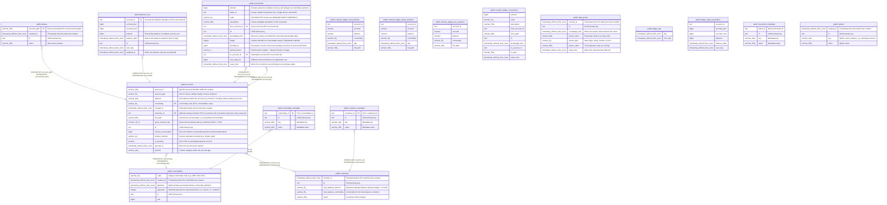

# go-luca

## Description

Movement-based double-entry bookkeeping database schema

## Tables

| Name                                                                                  | Columns | Comment                                                                                                                                                                                                                                                                                                                                                | Type       |
| ------------------------------------------------------------------------------------- | ------- | ------------------------------------------------------------------------------------------------------------------------------------------------------------------------------------------------------------------------------------------------------------------------------------------------------------------------------------------------------ | ---------- |
| [public.accounts](public.accounts.md)                                                 | 14      | Chart of accounts. Each account has a hierarchical path (Type:Product:AccountID:Address) and belongs to one of five fundamental types: Asset, Liability, Equity, Income, Expense. An account optionally belongs to a customer (many accounts per customer). Amounts are stored as integers at the precision defined by the commodity's exponent.  | BASE TABLE |
| [public.aliases](public.aliases.md)                                                   | 4       | Short name aliases for account paths. Allows .goluca files and users to reference accounts by a short name instead of the full hierarchical path.                                                                                                                                                                                                 | BASE TABLE |
| [public.balances_live](public.balances_live.md)                                       | 8       | Pre-computed end-of-day balance snapshots for today and tomorrow only. Holds at most two days of balances per account — older entries are pruned. Updated transactionally when movements are recorded via RecordMovementWithProjections. Avoids expensive SUM queries for frequently accessed current and projected balances.                     | BASE TABLE |
| [public.commodities](public.commodities.md)                                           | 6       | Currency/commodity definitions. Each commodity has a unique code and an exponent that defines the precision of amounts (e.g. -2 for pence). Accounts reference commodities via foreign key.                                                                                                                                                       | BASE TABLE |
| [public.commodity_metadata](public.commodity_metadata.md)                             | 4       | Key-value metadata for commodities.                                                                                                                                                                                                                                                                                                                    | BASE TABLE |
| [public.contract_ledger_eod_positions](public.contract_ledger_eod_positions.md)       | 6       |                                                                                                                                                                                                                                                                                                                                                        | VIEW       |
| [public.contract_ledger_latest_positions](public.contract_ledger_latest_positions.md) | 6       |                                                                                                                                                                                                                                                                                                                                                        | VIEW       |
| [public.contract_ledger_live_positions](public.contract_ledger_live_positions.md)     | 5       |                                                                                                                                                                                                                                                                                                                                                        | VIEW       |
| [public.contract_ledger_movements](public.contract_ledger_movements.md)               | 10      |                                                                                                                                                                                                                                                                                                                                                        | VIEW       |
| [public.customer_metadata](public.customer_metadata.md)                               | 4       | Key-value metadata for customers.                                                                                                                                                                                                                                                                                                                      | BASE TABLE |
| [public.customers](public.customers.md)                                               | 5       | Customer records. A customer may have zero to many accounts (via accounts.customer_id). Supports max balance constraints and arbitrary key-value metadata.                                                                                                                                                                                        | BASE TABLE |
| [public.data_points](public.data_points.md)                                           | 7       | Time-series parameter values. Stores named data points with value and knowledge timestamps for bitemporal queries (e.g. interest rate changes, exchange rates).                                                                                                                                                                                   | BASE TABLE |
| [public.ledger_day](public.ledger_day.md)                                             | 2       |                                                                                                                                                                                                                                                                                                                                                        | BASE TABLE |
| [public.ledger_latest_projections](public.ledger_latest_projections.md)               | 6       |                                                                                                                                                                                                                                                                                                                                                        | VIEW       |
| [public.movement_metadata](public.movement_metadata.md)                               | 4       | Key-value metadata for movement batches.                                                                                                                                                                                                                                                                                                               | BASE TABLE |
| [public.movements](public.movements.md)                                               | 13      | Core transaction records. Each movement transfers an integer amount from one account to another. Movements with the same batch_id form a linked transaction (compound entry). Inspired by TigerBeetle's transfer model with code, ledger, and pending_id fields.                                                                                  | BASE TABLE |
| [public.options](public.options.md)                                                   | 4       | Ledger-wide key-value configuration. Stores directives imported from .goluca files (e.g. operating-currency, require-accounts) and runtime settings.                                                                                                                                                                                              | BASE TABLE |

## Relations

```mermaid
erDiagram

"public.accounts" }o--|| "public.commodities" : "FOREIGN KEY (commodity) REFERENCES commodities(code)"
"public.accounts" }o--o| "public.customers" : "FOREIGN KEY (customer_id) REFERENCES customers(id)"
"public.aliases" }o--|| "public.accounts" : "FOREIGN KEY (account_path) REFERENCES accounts(full_path)"
"public.balances_live" }o--|| "public.accounts" : "FOREIGN KEY (account_id) REFERENCES accounts(id)"
"public.commodity_metadata" }o--|| "public.commodities" : "FOREIGN KEY (commodity_id) REFERENCES commodities(id)"
"public.customer_metadata" }o--|| "public.customers" : "FOREIGN KEY (customer_id) REFERENCES customers(id)"
"public.movements" }o--|| "public.accounts" : "FOREIGN KEY (from_account_id) REFERENCES accounts(id)"
"public.movements" }o--|| "public.accounts" : "FOREIGN KEY (to_account_id) REFERENCES accounts(id)"

"public.accounts" {
  varchar_100_ account_id "Specific account identifier within the product"
  varchar_50_ account_type "One of: Asset, Liability, Equity, Income, Expense"
  varchar_100_ address "Sub-address within the account (e.g. branch). 'Pending' marks pending accounts"
  varchar_50_ commodity FK "Commodity code (FK to commodities.code)"
  timestamp_without_time_zone created_at "Timestamp when the account was created"
  text customer_id FK "Optional owning customer (FK to customers.id). A customer may have many accounts"
  varchar_500_ full_path "Hierarchical account path, e.g. Asset:Bank:Current:Main"
  numeric_10_6_ gross_interest_rate "Gross annual interest rate as a decimal (0.045 = 4.5%)"
  text id "UUID primary key"
  bigint interest_accumulator "Sub-unit fractions at extended precision (method-dependent)"
  varchar_20_ interest_method "Interest calculation method (e.g. simple_daily)"
  boolean is_pending "True if this is a pending/suspense account"
  timestamp_without_time_zone opened_at "When the account was opened"
  varchar_100_ product "Product category within the account type"
}
"public.aliases" {
  varchar_500_ account_path FK "Full account path (FK to accounts.full_path)"
  timestamp_without_time_zone created_at "Timestamp when the alias was created"
  text id "UUID primary key"
  varchar_200_ name "Alias name (unique)"
}
"public.balances_live" {
  text account_id FK "Account this balance belongs to (FK to accounts.id)"
  bigint accrued_den ""
  bigint accrued_num ""
  bigint balance "End-of-day balance in smallest currency unit"
  timestamp_without_time_zone balance_date "Date of the balance snapshot (start of day)"
  text id "UUID primary key"
  timestamp_without_time_zone next_day ""
  timestamp_without_time_zone updated_at "When this balance was last recomputed"
}
"public.commodities" {
  varchar_50_ code "Unique commodity code (e.g. GBP, USD, BTC)"
  timestamp_without_time_zone created_at "Timestamp when the commodity was created"
  timestamp_without_time_zone datetime "Optional date associated with the commodity definition"
  integer exponent "Decimal exponent for amount precision (-2 = pence, -8 = satoshi)"
  text id "UUID primary key"
  bigint unit ""
}
"public.commodity_metadata" {
  text commodity_id FK "FK to commodities.id"
  text id "UUID primary key"
  varchar_200_ key "Metadata key"
  varchar_500_ value "Metadata value"
}
"public.contract_ledger_eod_positions" {
  text account_id ""
  numeric accrued ""
  numeric balance ""
  varchar_50_ commodity ""
  timestamp_without_time_zone day ""
  varchar_500_ full_path ""
}
"public.contract_ledger_latest_positions" {
  text account_id ""
  numeric accrued ""
  numeric balance ""
  varchar_50_ commodity ""
  timestamp_without_time_zone day ""
  varchar_500_ full_path ""
}
"public.contract_ledger_live_positions" {
  text account_id ""
  numeric accrued ""
  numeric balance ""
  varchar_50_ commodity ""
  varchar_500_ full_path ""
}
"public.contract_ledger_movements" {
  bigint amount ""
  varchar_14_ code ""
  varchar_500_ description ""
  text from_account_id ""
  varchar_500_ from_path ""
  text id ""
  timestamp_without_time_zone knowledge_time ""
  text to_account_id ""
  varchar_500_ to_path ""
  timestamp_without_time_zone value_time ""
}
"public.customer_metadata" {
  text customer_id FK "FK to customers.id"
  text id "UUID primary key"
  varchar_200_ key "Metadata key"
  varchar_500_ value "Metadata value"
}
"public.customers" {
  timestamp_without_time_zone created_at "Timestamp when the customer was created"
  text id "UUID primary key"
  varchar_50_ max_balance_amount "Maximum allowed balance amount (empty = no limit)"
  varchar_50_ max_balance_commodity "Commodity for the max balance constraint"
  varchar_200_ name "Customer name (unique)"
}
"public.data_points" {
  timestamp_without_time_zone created_at "Timestamp when the data point was created"
  text id "UUID primary key"
  timestamp_without_time_zone knowledge_time "When the system learned about this value"
  varchar_200_ param_name "Parameter name (e.g. base-rate)"
  varchar_20_ param_type "Value type: string, number, or bool"
  varchar_500_ param_value "The parameter value as a string"
  timestamp_without_time_zone value_time "When this value became effective"
}
"public.ledger_day" {
  timestamp_without_time_zone day ""
  timestamp_without_time_zone prev_day ""
}
"public.ledger_latest_projections" {
  text account_id ""
  bigint accrued_den ""
  bigint accrued_num ""
  bigint balance ""
  timestamp_without_time_zone balance_date ""
  timestamp_without_time_zone next_day ""
}
"public.movement_metadata" {
  text batch_id "Movement batch ID"
  text id "UUID primary key"
  varchar_200_ key "Metadata key"
  varchar_500_ value "Metadata value"
}
"public.movements" {
  bigint amount "Transfer amount in smallest currency unit (integer at commodity exponent)"
  text batch_id "Groups related movements into a single atomic transaction"
  varchar_14_ code "ISO 20022 BTC mnemonic (DOMAIN:FAMILY:SUBFAMILY)"
  varchar_500_ description "Human-readable description of the movement"
  text from_account_id FK "Source account (FK to accounts.id)"
  text id "UUID primary key"
  timestamp_without_time_zone knowledge_time "When the system recorded this movement (knowledge date)"
  integer ledger "Partition identifier for multi-ledger setups (TigerBeetle-inspired)"
  bigint pending_id "Two-phase commit: references pending movement to post/void (0=N/A)"
  varchar_1_ period_anchor "Period anchor marker: ^ (start), $ (end), or empty"
  text to_account_id FK "Destination account (FK to accounts.id)"
  bigint user_data_64 "Arbitrary external reference for application use"
  timestamp_without_time_zone value_time "When the movement economically occurred (value date)"
}
"public.options" {
  timestamp_without_time_zone created_at "Timestamp when the option was created"
  text id "UUID primary key"
  varchar_200_ key "Option name (unique), e.g. operating-currency"
  varchar_500_ value "Option value"
}
```

---

> Generated by [tbls](https://github.com/k1LoW/tbls)
