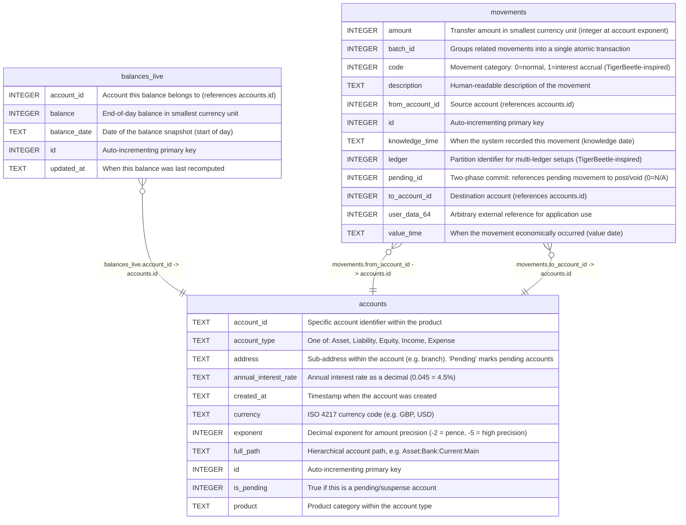

# accounts

## Description

Chart of accounts. Each account has a hierarchical path (Type:Product:AccountID:Address) and belongs to one of five fundamental types: Asset, Liability, Equity, Income, Expense. Amounts are stored as integers at the precision defined by exponent (e.g. -2 for pence).  


<details>
<summary><strong>Table Definition</strong></summary>

```sql
CREATE TABLE accounts (
    id INTEGER PRIMARY KEY AUTOINCREMENT,
    full_path TEXT NOT NULL UNIQUE,
    account_type TEXT NOT NULL,
    product TEXT NOT NULL DEFAULT '',
    account_id TEXT NOT NULL DEFAULT '',
    address TEXT NOT NULL DEFAULT '',
    is_pending INTEGER DEFAULT 0,
    currency TEXT NOT NULL DEFAULT 'GBP',
    exponent INTEGER NOT NULL DEFAULT -2,
    annual_interest_rate TEXT NOT NULL DEFAULT 0,
    created_at TEXT DEFAULT (datetime('now'))
)
```

</details>

## Columns

| Name                 | Type    | Default         | Nullable | Children                                                    | Parents | Comment                                                                        |
| -------------------- | ------- | --------------- | -------- | ----------------------------------------------------------- | ------- | ------------------------------------------------------------------------------ |
| account_id           | TEXT    | ''              | false    |                                                             |         | Specific account identifier within the product                                 |
| account_type         | TEXT    |                 | false    |                                                             |         | One of: Asset, Liability, Equity, Income, Expense                              |
| address              | TEXT    | ''              | false    |                                                             |         | Sub-address within the account (e.g. branch). 'Pending' marks pending accounts |
| annual_interest_rate | TEXT    | 0               | false    |                                                             |         | Annual interest rate as a decimal (0.045 = 4.5%)                               |
| created_at           | TEXT    | datetime('now') | true     |                                                             |         | Timestamp when the account was created                                         |
| currency             | TEXT    | 'GBP'           | false    |                                                             |         | ISO 4217 currency code (e.g. GBP, USD)                                         |
| exponent             | INTEGER | -2              | false    |                                                             |         | Decimal exponent for amount precision (-2 = pence, -5 = high precision)        |
| full_path            | TEXT    |                 | false    |                                                             |         | Hierarchical account path, e.g. Asset:Bank:Current:Main                        |
| id                   | INTEGER |                 | true     | [balances_live](balances_live.md) [movements](movements.md) |         | Auto-incrementing primary key                                                  |
| is_pending           | INTEGER | 0               | true     |                                                             |         | True if this is a pending/suspense account                                     |
| product              | TEXT    | ''              | false    |                                                             |         | Product category within the account type                                       |

## Constraints

| Name                        | Type        | Definition         |
| --------------------------- | ----------- | ------------------ |
| id                          | PRIMARY KEY | PRIMARY KEY (id)   |
| sqlite_autoindex_accounts_1 | UNIQUE      | UNIQUE (full_path) |

## Indexes

| Name                        | Definition         |
| --------------------------- | ------------------ |
| sqlite_autoindex_accounts_1 | UNIQUE (full_path) |

## Relations



---

> Generated by [tbls](https://github.com/k1LoW/tbls)
