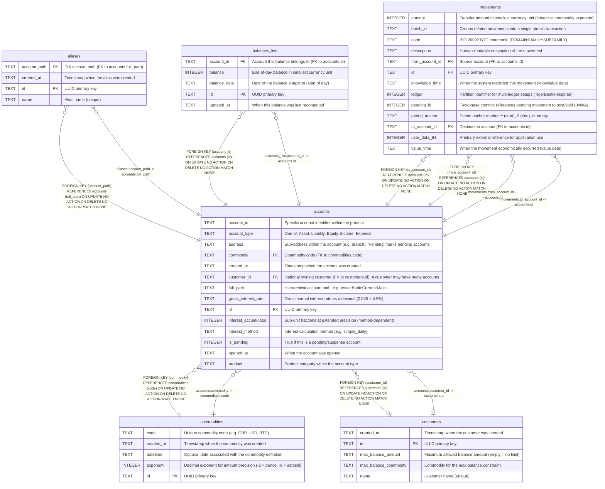

# accounts

## Description

Chart of accounts. Each account has a hierarchical path (Type:Product:AccountID:Address) and belongs to one of five fundamental types: Asset, Liability, Equity, Income, Expense. An account optionally belongs to a customer (many accounts per customer). Amounts are stored as integers at the precision defined by the commodity's exponent.  


<details>
<summary><strong>Table Definition</strong></summary>

```sql
CREATE TABLE accounts (
    id TEXT PRIMARY KEY,
    full_path TEXT NOT NULL UNIQUE,
    account_type TEXT NOT NULL,
    product TEXT NOT NULL DEFAULT '',
    account_id TEXT NOT NULL DEFAULT '',
    address TEXT NOT NULL DEFAULT '',
    is_pending INTEGER DEFAULT 0,
    commodity TEXT NOT NULL DEFAULT 'GBP' REFERENCES commodities(code),
    customer_id TEXT REFERENCES customers(id),
    gross_interest_rate TEXT NOT NULL DEFAULT 0,
    interest_method TEXT NOT NULL DEFAULT '',
    interest_accumulator INTEGER NOT NULL DEFAULT 0,
    opened_at TEXT,
    created_at TEXT DEFAULT (datetime('now'))
)
```

</details>

## Columns

| Name                 | Type    | Default         | Nullable | Children                                                    | Parents                       | Comment                                                                          |
| -------------------- | ------- | --------------- | -------- | ----------------------------------------------------------- | ----------------------------- | -------------------------------------------------------------------------------- |
| account_id           | TEXT    | ''              | false    |                                                             |                               | Specific account identifier within the product                                   |
| account_type         | TEXT    |                 | false    |                                                             |                               | One of: Asset, Liability, Equity, Income, Expense                                |
| address              | TEXT    | ''              | false    |                                                             |                               | Sub-address within the account (e.g. branch). 'Pending' marks pending accounts   |
| commodity            | TEXT    | 'GBP'           | false    |                                                             | [commodities](commodities.md) | Commodity code (FK to commodities.code)                                          |
| created_at           | TEXT    | datetime('now') | true     |                                                             |                               | Timestamp when the account was created                                           |
| customer_id          | TEXT    |                 | true     |                                                             | [customers](customers.md)     | Optional owning customer (FK to customers.id). A customer may have many accounts |
| full_path            | TEXT    |                 | false    | [aliases](aliases.md)                                       |                               | Hierarchical account path, e.g. Asset:Bank:Current:Main                          |
| gross_interest_rate  | TEXT    | 0               | false    |                                                             |                               | Gross annual interest rate as a decimal (0.045 = 4.5%)                           |
| id                   | TEXT    |                 | true     | [balances_live](balances_live.md) [movements](movements.md) |                               | UUID primary key                                                                 |
| interest_accumulator | INTEGER | 0               | false    |                                                             |                               | Sub-unit fractions at extended precision (method-dependent)                      |
| interest_method      | TEXT    | ''              | false    |                                                             |                               | Interest calculation method (e.g. simple_daily)                                  |
| is_pending           | INTEGER | 0               | true     |                                                             |                               | True if this is a pending/suspense account                                       |
| opened_at            | TEXT    |                 | true     |                                                             |                               | When the account was opened                                                      |
| product              | TEXT    | ''              | false    |                                                             |                               | Product category within the account type                                         |

## Constraints

| Name                        | Type        | Definition                                                                                               |
| --------------------------- | ----------- | -------------------------------------------------------------------------------------------------------- |
| - (Foreign key ID: 0)       | FOREIGN KEY | FOREIGN KEY (customer_id) REFERENCES customers (id) ON UPDATE NO ACTION ON DELETE NO ACTION MATCH NONE   |
| - (Foreign key ID: 1)       | FOREIGN KEY | FOREIGN KEY (commodity) REFERENCES commodities (code) ON UPDATE NO ACTION ON DELETE NO ACTION MATCH NONE |
| id                          | PRIMARY KEY | PRIMARY KEY (id)                                                                                         |
| sqlite_autoindex_accounts_1 | PRIMARY KEY | PRIMARY KEY (id)                                                                                         |
| sqlite_autoindex_accounts_2 | UNIQUE      | UNIQUE (full_path)                                                                                       |

## Indexes

| Name                        | Definition         |
| --------------------------- | ------------------ |
| sqlite_autoindex_accounts_1 | PRIMARY KEY (id)   |
| sqlite_autoindex_accounts_2 | UNIQUE (full_path) |

## Relations



---

> Generated by [tbls](https://github.com/k1LoW/tbls)
