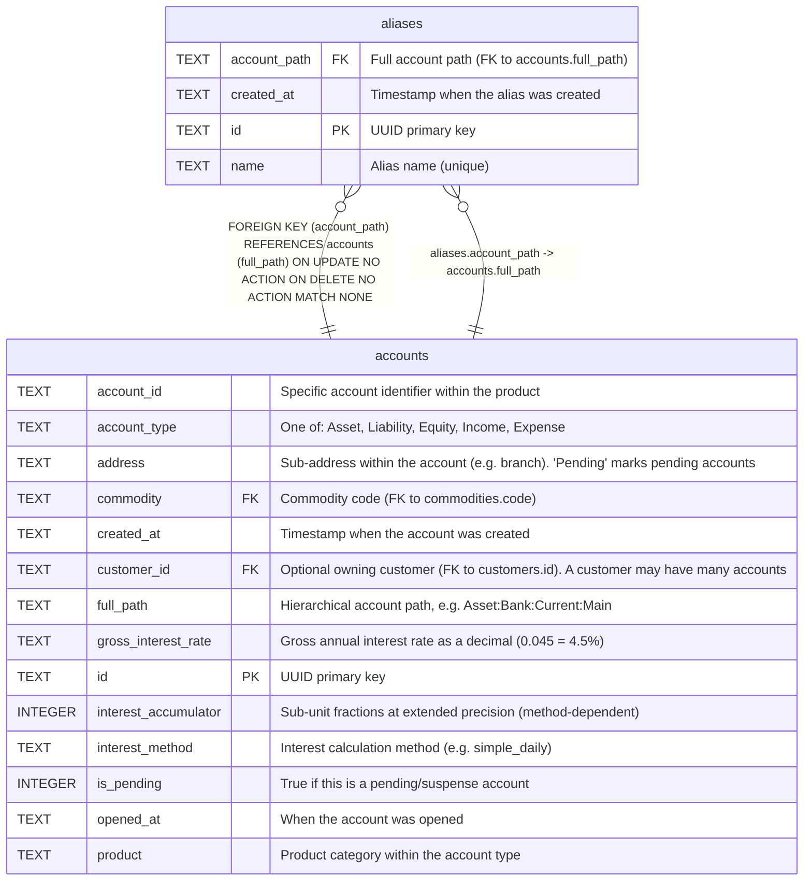

# aliases

## Description

Short name aliases for account paths. Allows .goluca files and users to reference accounts by a short name instead of the full hierarchical path.  


<details>
<summary><strong>Table Definition</strong></summary>

```sql
CREATE TABLE aliases (
    id TEXT PRIMARY KEY,
    name TEXT NOT NULL UNIQUE,
    account_path TEXT NOT NULL REFERENCES accounts(full_path),
    created_at TEXT DEFAULT (datetime('now'))
)
```

</details>

## Columns

| Name         | Type | Default         | Nullable | Children | Parents                 | Comment                                      |
| ------------ | ---- | --------------- | -------- | -------- | ----------------------- | -------------------------------------------- |
| account_path | TEXT |                 | false    |          | [accounts](accounts.md) | Full account path (FK to accounts.full_path) |
| created_at   | TEXT | datetime('now') | true     |          |                         | Timestamp when the alias was created         |
| id           | TEXT |                 | true     |          |                         | UUID primary key                             |
| name         | TEXT |                 | false    |          |                         | Alias name (unique)                          |

## Constraints

| Name                       | Type        | Definition                                                                                                    |
| -------------------------- | ----------- | ------------------------------------------------------------------------------------------------------------- |
| - (Foreign key ID: 0)      | FOREIGN KEY | FOREIGN KEY (account_path) REFERENCES accounts (full_path) ON UPDATE NO ACTION ON DELETE NO ACTION MATCH NONE |
| id                         | PRIMARY KEY | PRIMARY KEY (id)                                                                                              |
| sqlite_autoindex_aliases_1 | PRIMARY KEY | PRIMARY KEY (id)                                                                                              |
| sqlite_autoindex_aliases_2 | UNIQUE      | UNIQUE (name)                                                                                                 |

## Indexes

| Name                       | Definition       |
| -------------------------- | ---------------- |
| sqlite_autoindex_aliases_1 | PRIMARY KEY (id) |
| sqlite_autoindex_aliases_2 | UNIQUE (name)    |

## Relations



---

> Generated by [tbls](https://github.com/k1LoW/tbls)
