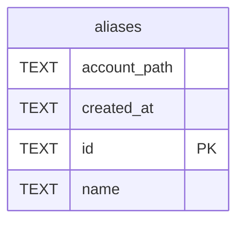

# aliases

## Description

<details>
<summary><strong>Table Definition</strong></summary>

```sql
CREATE TABLE aliases (
    id TEXT PRIMARY KEY,
    name TEXT NOT NULL UNIQUE,
    account_path TEXT NOT NULL,
    created_at TEXT DEFAULT (datetime('now'))
)
```

</details>

## Columns

| Name         | Type | Default         | Nullable | Children | Parents | Comment |
| ------------ | ---- | --------------- | -------- | -------- | ------- | ------- |
| account_path | TEXT |                 | false    |          |         |         |
| created_at   | TEXT | datetime('now') | true     |          |         |         |
| id           | TEXT |                 | true     |          |         |         |
| name         | TEXT |                 | false    |          |         |         |

## Constraints

| Name                       | Type        | Definition       |
| -------------------------- | ----------- | ---------------- |
| id                         | PRIMARY KEY | PRIMARY KEY (id) |
| sqlite_autoindex_aliases_1 | PRIMARY KEY | PRIMARY KEY (id) |
| sqlite_autoindex_aliases_2 | UNIQUE      | UNIQUE (name)    |

## Indexes

| Name                       | Definition       |
| -------------------------- | ---------------- |
| sqlite_autoindex_aliases_1 | PRIMARY KEY (id) |
| sqlite_autoindex_aliases_2 | UNIQUE (name)    |

## Relations



---

> Generated by [tbls](https://github.com/k1LoW/tbls)
