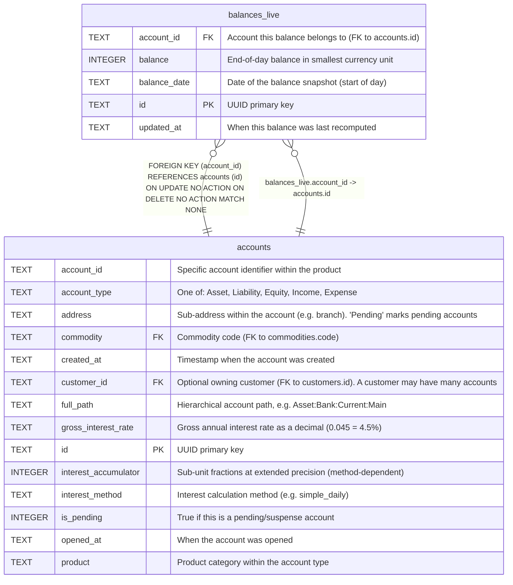

# balances_live

## Description

Pre-computed end-of-day balance snapshots for today and tomorrow only. Holds at most two days of balances per account — older entries are pruned. Updated transactionally when movements are recorded via RecordMovementWithProjections. Avoids expensive SUM queries for frequently accessed current and projected balances.  


<details>
<summary><strong>Table Definition</strong></summary>

```sql
CREATE TABLE balances_live (
    id TEXT PRIMARY KEY,
    account_id TEXT NOT NULL REFERENCES accounts(id),
    balance_date TEXT NOT NULL,
    balance INTEGER NOT NULL,
    updated_at TEXT DEFAULT (datetime('now'))
)
```

</details>

## Columns

| Name         | Type    | Default         | Nullable | Children | Parents                 | Comment                                             |
| ------------ | ------- | --------------- | -------- | -------- | ----------------------- | --------------------------------------------------- |
| account_id   | TEXT    |                 | false    |          | [accounts](accounts.md) | Account this balance belongs to (FK to accounts.id) |
| balance      | INTEGER |                 | false    |          |                         | End-of-day balance in smallest currency unit        |
| balance_date | TEXT    |                 | false    |          |                         | Date of the balance snapshot (start of day)         |
| id           | TEXT    |                 | true     |          |                         | UUID primary key                                    |
| updated_at   | TEXT    | datetime('now') | true     |          |                         | When this balance was last recomputed               |

## Constraints

| Name                             | Type        | Definition                                                                                           |
| -------------------------------- | ----------- | ---------------------------------------------------------------------------------------------------- |
| - (Foreign key ID: 0)            | FOREIGN KEY | FOREIGN KEY (account_id) REFERENCES accounts (id) ON UPDATE NO ACTION ON DELETE NO ACTION MATCH NONE |
| id                               | PRIMARY KEY | PRIMARY KEY (id)                                                                                     |
| sqlite_autoindex_balances_live_1 | PRIMARY KEY | PRIMARY KEY (id)                                                                                     |

## Indexes

| Name                             | Definition                                                                                       |
| -------------------------------- | ------------------------------------------------------------------------------------------------ |
| idx_balances_live_unique         | CREATE UNIQUE INDEX idx_balances_live_unique<br />    ON balances_live(account_id, balance_date) |
| sqlite_autoindex_balances_live_1 | PRIMARY KEY (id)                                                                                 |

## Relations



---

> Generated by [tbls](https://github.com/k1LoW/tbls)
