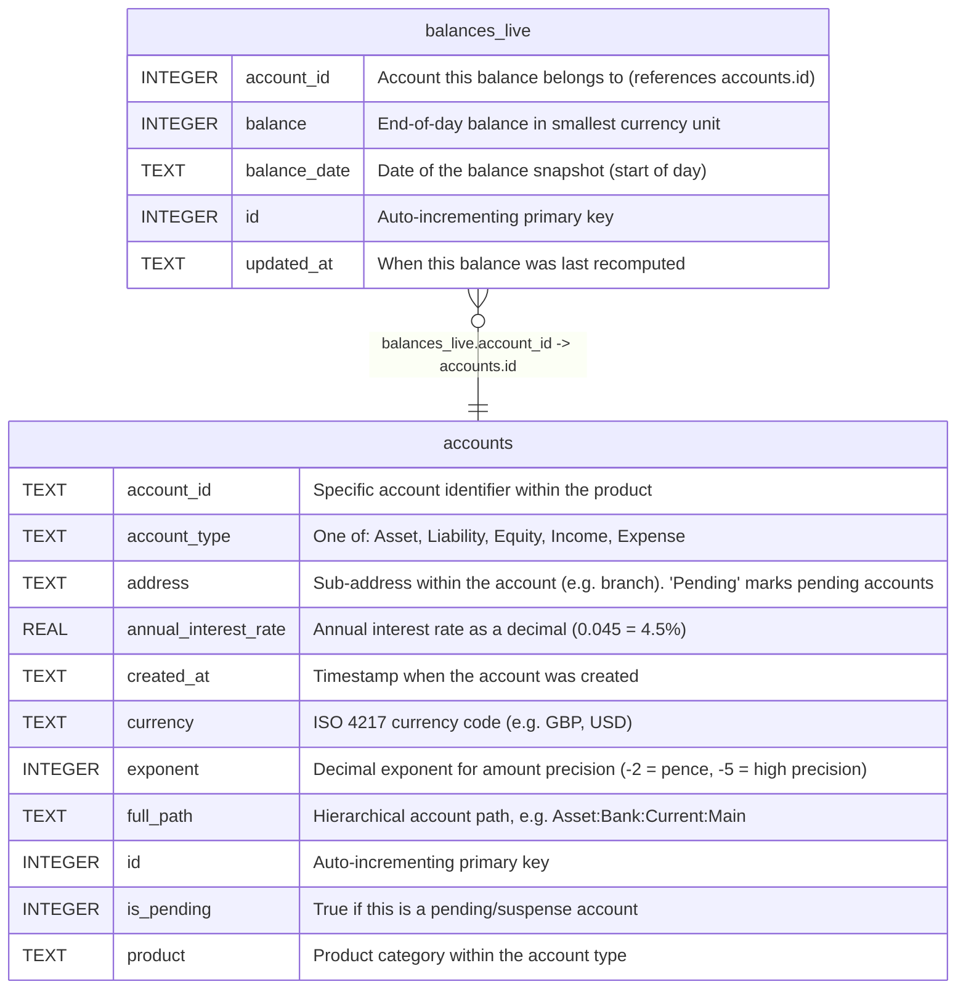

# balances_live

## Description

Pre-computed end-of-day balance snapshots. Updated transactionally when movements are recorded via RecordMovementWithProjections. Avoids expensive SUM queries for frequently accessed balances.  


<details>
<summary><strong>Table Definition</strong></summary>

```sql
CREATE TABLE balances_live (
    id INTEGER PRIMARY KEY AUTOINCREMENT,
    account_id INTEGER NOT NULL,
    balance_date TEXT NOT NULL,
    balance INTEGER NOT NULL,
    updated_at TEXT DEFAULT (datetime('now'))
)
```

</details>

## Columns

| Name         | Type    | Default         | Nullable | Children | Parents                 | Comment                                                  |
| ------------ | ------- | --------------- | -------- | -------- | ----------------------- | -------------------------------------------------------- |
| account_id   | INTEGER |                 | false    |          | [accounts](accounts.md) | Account this balance belongs to (references accounts.id) |
| balance      | INTEGER |                 | false    |          |                         | End-of-day balance in smallest currency unit             |
| balance_date | TEXT    |                 | false    |          |                         | Date of the balance snapshot (start of day)              |
| id           | INTEGER |                 | true     |          |                         | Auto-incrementing primary key                            |
| updated_at   | TEXT    | datetime('now') | true     |          |                         | When this balance was last recomputed                    |

## Constraints

| Name | Type        | Definition       |
| ---- | ----------- | ---------------- |
| id   | PRIMARY KEY | PRIMARY KEY (id) |

## Indexes

| Name                     | Definition                                                                                       |
| ------------------------ | ------------------------------------------------------------------------------------------------ |
| idx_balances_live_unique | CREATE UNIQUE INDEX idx_balances_live_unique<br />    ON balances_live(account_id, balance_date) |

## Relations



---

> Generated by [tbls](https://github.com/k1LoW/tbls)
