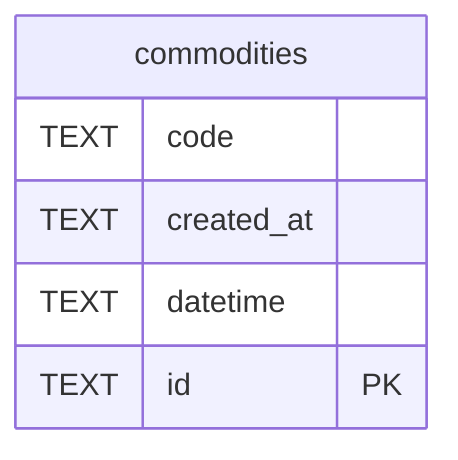

# commodities

## Description

<details>
<summary><strong>Table Definition</strong></summary>

```sql
CREATE TABLE commodities (
    id TEXT PRIMARY KEY,
    code TEXT NOT NULL UNIQUE,
    datetime TEXT,
    created_at TEXT DEFAULT (datetime('now'))
)
```

</details>

## Columns

| Name       | Type | Default         | Nullable | Children | Parents | Comment |
| ---------- | ---- | --------------- | -------- | -------- | ------- | ------- |
| code       | TEXT |                 | false    |          |         |         |
| created_at | TEXT | datetime('now') | true     |          |         |         |
| datetime   | TEXT |                 | true     |          |         |         |
| id         | TEXT |                 | true     |          |         |         |

## Constraints

| Name                           | Type        | Definition       |
| ------------------------------ | ----------- | ---------------- |
| id                             | PRIMARY KEY | PRIMARY KEY (id) |
| sqlite_autoindex_commodities_1 | PRIMARY KEY | PRIMARY KEY (id) |
| sqlite_autoindex_commodities_2 | UNIQUE      | UNIQUE (code)    |

## Indexes

| Name                           | Definition       |
| ------------------------------ | ---------------- |
| sqlite_autoindex_commodities_1 | PRIMARY KEY (id) |
| sqlite_autoindex_commodities_2 | UNIQUE (code)    |

## Relations



---

> Generated by [tbls](https://github.com/k1LoW/tbls)
