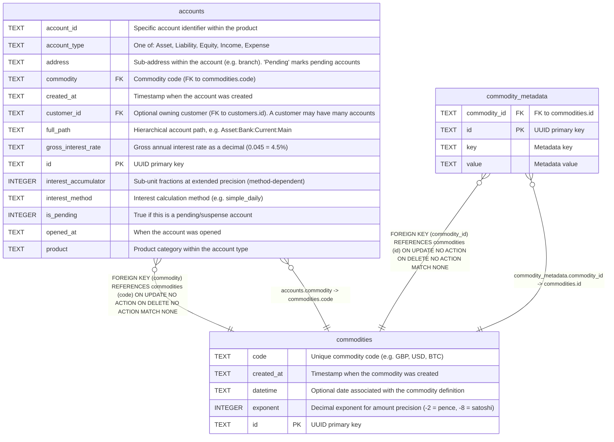

# commodities

## Description

Currency/commodity definitions. Each commodity has a unique code and an exponent that defines the precision of amounts (e.g. -2 for pence). Accounts reference commodities via foreign key.  


<details>
<summary><strong>Table Definition</strong></summary>

```sql
CREATE TABLE commodities (
    id TEXT PRIMARY KEY,
    code TEXT NOT NULL UNIQUE,
    exponent INTEGER NOT NULL DEFAULT -2,
    datetime TEXT,
    created_at TEXT DEFAULT (datetime('now'))
)
```

</details>

## Columns

| Name       | Type    | Default         | Nullable | Children                                    | Parents | Comment                                                          |
| ---------- | ------- | --------------- | -------- | ------------------------------------------- | ------- | ---------------------------------------------------------------- |
| code       | TEXT    |                 | false    | [accounts](accounts.md)                     |         | Unique commodity code (e.g. GBP, USD, BTC)                       |
| created_at | TEXT    | datetime('now') | true     |                                             |         | Timestamp when the commodity was created                         |
| datetime   | TEXT    |                 | true     |                                             |         | Optional date associated with the commodity definition           |
| exponent   | INTEGER | -2              | false    |                                             |         | Decimal exponent for amount precision (-2 = pence, -8 = satoshi) |
| id         | TEXT    |                 | true     | [commodity_metadata](commodity_metadata.md) |         | UUID primary key                                                 |

## Constraints

| Name                           | Type        | Definition       |
| ------------------------------ | ----------- | ---------------- |
| id                             | PRIMARY KEY | PRIMARY KEY (id) |
| sqlite_autoindex_commodities_1 | PRIMARY KEY | PRIMARY KEY (id) |
| sqlite_autoindex_commodities_2 | UNIQUE      | UNIQUE (code)    |

## Indexes

| Name                           | Definition       |
| ------------------------------ | ---------------- |
| sqlite_autoindex_commodities_1 | PRIMARY KEY (id) |
| sqlite_autoindex_commodities_2 | UNIQUE (code)    |

## Relations



---

> Generated by [tbls](https://github.com/k1LoW/tbls)
