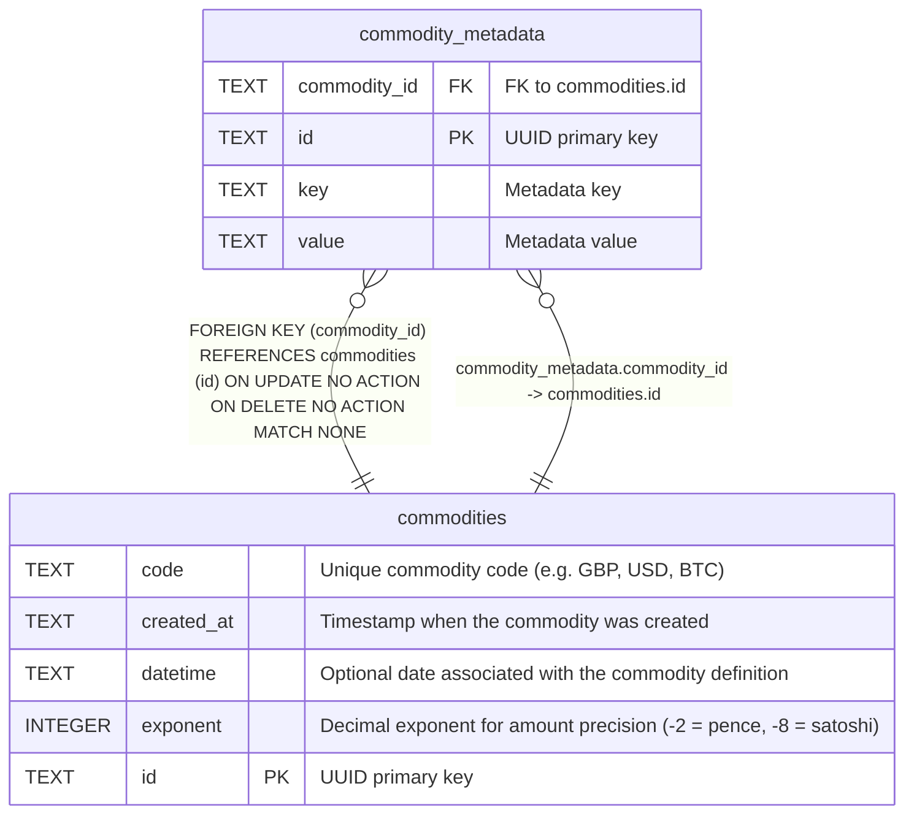

# commodity_metadata

## Description

Key-value metadata for commodities.

<details>
<summary><strong>Table Definition</strong></summary>

```sql
CREATE TABLE commodity_metadata (
    id TEXT PRIMARY KEY,
    commodity_id TEXT NOT NULL REFERENCES commodities(id),
    key TEXT NOT NULL,
    value TEXT NOT NULL DEFAULT ''
)
```

</details>

## Columns

| Name         | Type | Default | Nullable | Children | Parents                       | Comment              |
| ------------ | ---- | ------- | -------- | -------- | ----------------------------- | -------------------- |
| commodity_id | TEXT |         | false    |          | [commodities](commodities.md) | FK to commodities.id |
| id           | TEXT |         | true     |          |                               | UUID primary key     |
| key          | TEXT |         | false    |          |                               | Metadata key         |
| value        | TEXT | ''      | false    |          |                               | Metadata value       |

## Constraints

| Name                                  | Type        | Definition                                                                                                |
| ------------------------------------- | ----------- | --------------------------------------------------------------------------------------------------------- |
| - (Foreign key ID: 0)                 | FOREIGN KEY | FOREIGN KEY (commodity_id) REFERENCES commodities (id) ON UPDATE NO ACTION ON DELETE NO ACTION MATCH NONE |
| id                                    | PRIMARY KEY | PRIMARY KEY (id)                                                                                          |
| sqlite_autoindex_commodity_metadata_1 | PRIMARY KEY | PRIMARY KEY (id)                                                                                          |

## Indexes

| Name                                  | Definition                                                                                 |
| ------------------------------------- | ------------------------------------------------------------------------------------------ |
| idx_commodity_metadata_unique         | CREATE UNIQUE INDEX idx_commodity_metadata_unique ON commodity_metadata(commodity_id, key) |
| sqlite_autoindex_commodity_metadata_1 | PRIMARY KEY (id)                                                                           |

## Relations



---

> Generated by [tbls](https://github.com/k1LoW/tbls)
