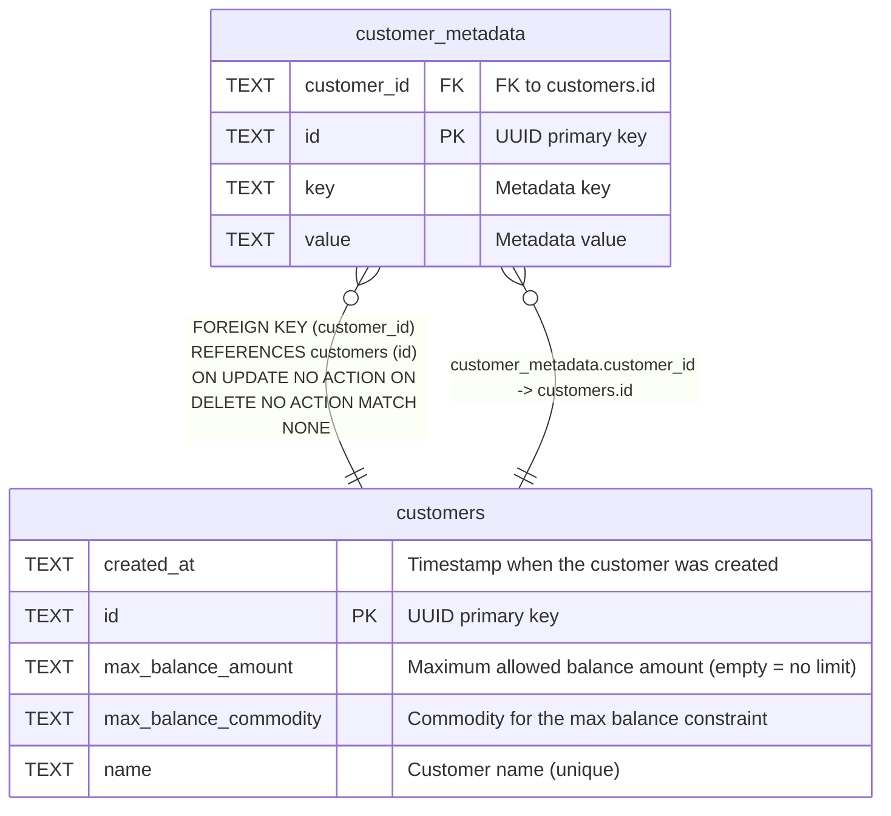

# customer_metadata

## Description

Key-value metadata for customers.

<details>
<summary><strong>Table Definition</strong></summary>

```sql
CREATE TABLE customer_metadata (
    id TEXT PRIMARY KEY,
    customer_id TEXT NOT NULL REFERENCES customers(id),
    key TEXT NOT NULL,
    value TEXT NOT NULL DEFAULT ''
)
```

</details>

## Columns

| Name        | Type | Default | Nullable | Children | Parents                   | Comment            |
| ----------- | ---- | ------- | -------- | -------- | ------------------------- | ------------------ |
| customer_id | TEXT |         | false    |          | [customers](customers.md) | FK to customers.id |
| id          | TEXT |         | true     |          |                           | UUID primary key   |
| key         | TEXT |         | false    |          |                           | Metadata key       |
| value       | TEXT | ''      | false    |          |                           | Metadata value     |

## Constraints

| Name                                 | Type        | Definition                                                                                             |
| ------------------------------------ | ----------- | ------------------------------------------------------------------------------------------------------ |
| - (Foreign key ID: 0)                | FOREIGN KEY | FOREIGN KEY (customer_id) REFERENCES customers (id) ON UPDATE NO ACTION ON DELETE NO ACTION MATCH NONE |
| id                                   | PRIMARY KEY | PRIMARY KEY (id)                                                                                       |
| sqlite_autoindex_customer_metadata_1 | PRIMARY KEY | PRIMARY KEY (id)                                                                                       |

## Indexes

| Name                                 | Definition                                                                              |
| ------------------------------------ | --------------------------------------------------------------------------------------- |
| idx_customer_metadata_unique         | CREATE UNIQUE INDEX idx_customer_metadata_unique ON customer_metadata(customer_id, key) |
| sqlite_autoindex_customer_metadata_1 | PRIMARY KEY (id)                                                                        |

## Relations



---

> Generated by [tbls](https://github.com/k1LoW/tbls)
