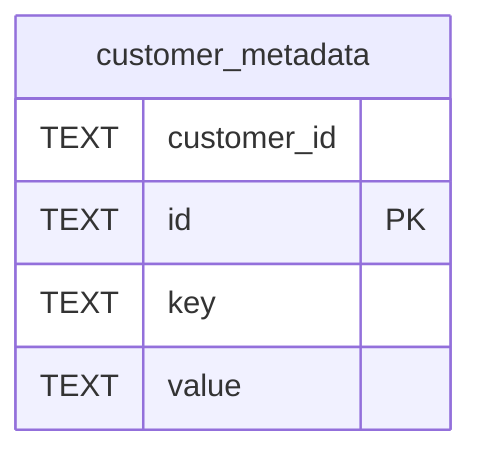

# customer_metadata

## Description

<details>
<summary><strong>Table Definition</strong></summary>

```sql
CREATE TABLE customer_metadata (
    id TEXT PRIMARY KEY,
    customer_id TEXT NOT NULL,
    key TEXT NOT NULL,
    value TEXT NOT NULL DEFAULT ''
)
```

</details>

## Columns

| Name        | Type | Default | Nullable | Children | Parents | Comment |
| ----------- | ---- | ------- | -------- | -------- | ------- | ------- |
| customer_id | TEXT |         | false    |          |         |         |
| id          | TEXT |         | true     |          |         |         |
| key         | TEXT |         | false    |          |         |         |
| value       | TEXT | ''      | false    |          |         |         |

## Constraints

| Name                                 | Type        | Definition       |
| ------------------------------------ | ----------- | ---------------- |
| id                                   | PRIMARY KEY | PRIMARY KEY (id) |
| sqlite_autoindex_customer_metadata_1 | PRIMARY KEY | PRIMARY KEY (id) |

## Indexes

| Name                                 | Definition                                                                              |
| ------------------------------------ | --------------------------------------------------------------------------------------- |
| idx_customer_metadata_unique         | CREATE UNIQUE INDEX idx_customer_metadata_unique ON customer_metadata(customer_id, key) |
| sqlite_autoindex_customer_metadata_1 | PRIMARY KEY (id)                                                                        |

## Relations



---

> Generated by [tbls](https://github.com/k1LoW/tbls)
