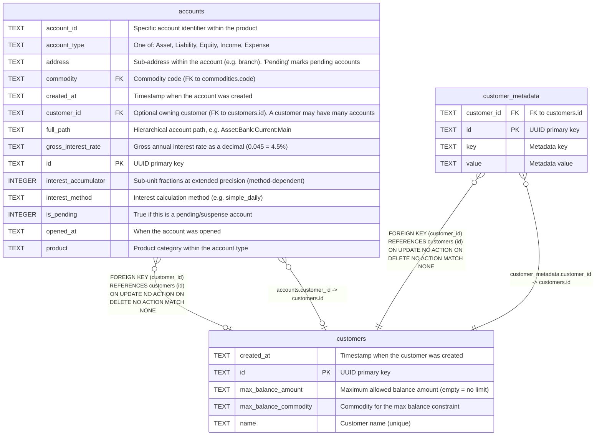

# customers

## Description

Customer records. A customer may have zero to many accounts (via accounts.customer_id). Supports max balance constraints and arbitrary key-value metadata.  


<details>
<summary><strong>Table Definition</strong></summary>

```sql
CREATE TABLE customers (
    id TEXT PRIMARY KEY,
    name TEXT NOT NULL UNIQUE,
    max_balance_amount TEXT NOT NULL DEFAULT '',
    max_balance_commodity TEXT NOT NULL DEFAULT '',
    created_at TEXT DEFAULT (datetime('now'))
)
```

</details>

## Columns

| Name                  | Type | Default         | Nullable | Children                                                          | Parents | Comment                                           |
| --------------------- | ---- | --------------- | -------- | ----------------------------------------------------------------- | ------- | ------------------------------------------------- |
| created_at            | TEXT | datetime('now') | true     |                                                                   |         | Timestamp when the customer was created           |
| id                    | TEXT |                 | true     | [accounts](accounts.md) [customer_metadata](customer_metadata.md) |         | UUID primary key                                  |
| max_balance_amount    | TEXT | ''              | false    |                                                                   |         | Maximum allowed balance amount (empty = no limit) |
| max_balance_commodity | TEXT | ''              | false    |                                                                   |         | Commodity for the max balance constraint          |
| name                  | TEXT |                 | false    |                                                                   |         | Customer name (unique)                            |

## Constraints

| Name                         | Type        | Definition       |
| ---------------------------- | ----------- | ---------------- |
| id                           | PRIMARY KEY | PRIMARY KEY (id) |
| sqlite_autoindex_customers_1 | PRIMARY KEY | PRIMARY KEY (id) |
| sqlite_autoindex_customers_2 | UNIQUE      | UNIQUE (name)    |

## Indexes

| Name                         | Definition       |
| ---------------------------- | ---------------- |
| sqlite_autoindex_customers_1 | PRIMARY KEY (id) |
| sqlite_autoindex_customers_2 | UNIQUE (name)    |

## Relations



---

> Generated by [tbls](https://github.com/k1LoW/tbls)
