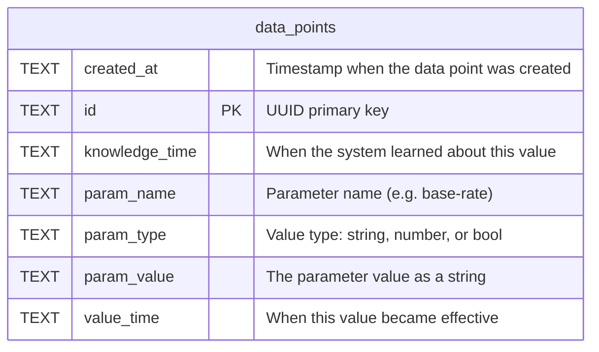

# data_points

## Description

Time-series parameter values. Stores named data points with value and knowledge timestamps for bitemporal queries (e.g. interest rate changes, exchange rates).  


<details>
<summary><strong>Table Definition</strong></summary>

```sql
CREATE TABLE data_points (
    id TEXT PRIMARY KEY,
    value_time TEXT NOT NULL,
    knowledge_time TEXT DEFAULT (datetime('now')),
    param_name TEXT NOT NULL,
    param_type TEXT NOT NULL DEFAULT 'string',
    param_value TEXT NOT NULL DEFAULT '',
    created_at TEXT DEFAULT (datetime('now'))
)
```

</details>

## Columns

| Name           | Type | Default         | Nullable | Children | Parents | Comment                                   |
| -------------- | ---- | --------------- | -------- | -------- | ------- | ----------------------------------------- |
| created_at     | TEXT | datetime('now') | true     |          |         | Timestamp when the data point was created |
| id             | TEXT |                 | true     |          |         | UUID primary key                          |
| knowledge_time | TEXT | datetime('now') | true     |          |         | When the system learned about this value  |
| param_name     | TEXT |                 | false    |          |         | Parameter name (e.g. base-rate)           |
| param_type     | TEXT | 'string'        | false    |          |         | Value type: string, number, or bool       |
| param_value    | TEXT | ''              | false    |          |         | The parameter value as a string           |
| value_time     | TEXT |                 | false    |          |         | When this value became effective          |

## Constraints

| Name                           | Type        | Definition       |
| ------------------------------ | ----------- | ---------------- |
| id                             | PRIMARY KEY | PRIMARY KEY (id) |
| sqlite_autoindex_data_points_1 | PRIMARY KEY | PRIMARY KEY (id) |

## Indexes

| Name                           | Definition                                                                    |
| ------------------------------ | ----------------------------------------------------------------------------- |
| idx_data_points_name_time      | CREATE INDEX idx_data_points_name_time ON data_points(param_name, value_time) |
| sqlite_autoindex_data_points_1 | PRIMARY KEY (id)                                                              |

## Relations



---

> Generated by [tbls](https://github.com/k1LoW/tbls)
