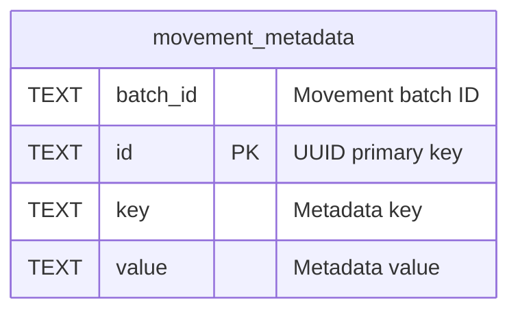

# movement_metadata

## Description

Key-value metadata for movement batches.

<details>
<summary><strong>Table Definition</strong></summary>

```sql
CREATE TABLE movement_metadata (
    id TEXT PRIMARY KEY,
    batch_id TEXT NOT NULL,
    key TEXT NOT NULL,
    value TEXT NOT NULL DEFAULT ''
)
```

</details>

## Columns

| Name     | Type | Default | Nullable | Children | Parents | Comment           |
| -------- | ---- | ------- | -------- | -------- | ------- | ----------------- |
| batch_id | TEXT |         | false    |          |         | Movement batch ID |
| id       | TEXT |         | true     |          |         | UUID primary key  |
| key      | TEXT |         | false    |          |         | Metadata key      |
| value    | TEXT | ''      | false    |          |         | Metadata value    |

## Constraints

| Name                                 | Type        | Definition       |
| ------------------------------------ | ----------- | ---------------- |
| id                                   | PRIMARY KEY | PRIMARY KEY (id) |
| sqlite_autoindex_movement_metadata_1 | PRIMARY KEY | PRIMARY KEY (id) |

## Indexes

| Name                                 | Definition                                                                           |
| ------------------------------------ | ------------------------------------------------------------------------------------ |
| idx_movement_metadata_unique         | CREATE UNIQUE INDEX idx_movement_metadata_unique ON movement_metadata(batch_id, key) |
| sqlite_autoindex_movement_metadata_1 | PRIMARY KEY (id)                                                                     |

## Relations



---

> Generated by [tbls](https://github.com/k1LoW/tbls)
