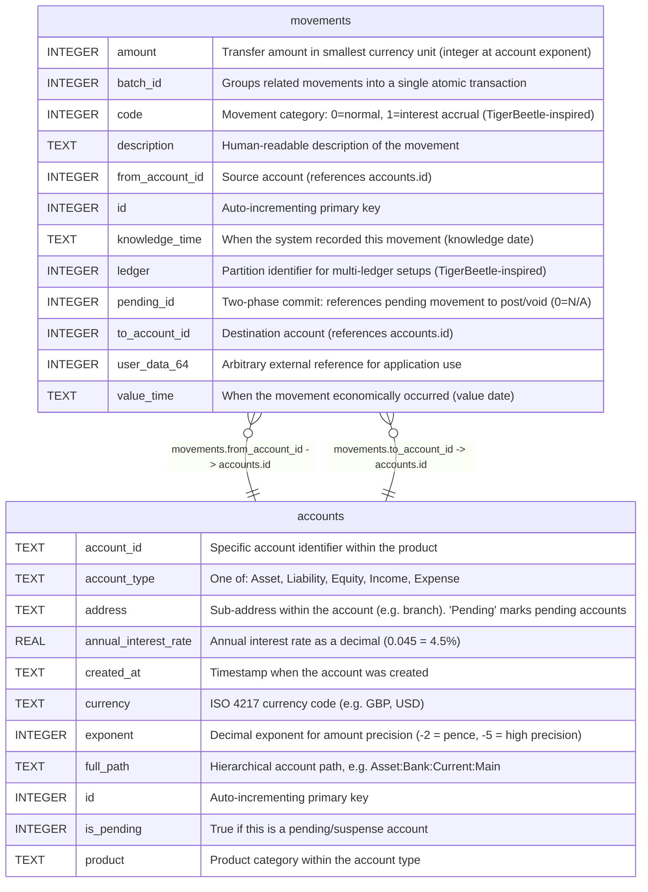

# movements

## Description

Core transaction records. Each movement transfers an integer amount from one account to another. Movements with the same batch_id form a linked transaction (compound entry). Inspired by TigerBeetle's transfer model with code, ledger, and pending_id fields.  


<details>
<summary><strong>Table Definition</strong></summary>

```sql
CREATE TABLE movements (
    id INTEGER PRIMARY KEY AUTOINCREMENT,
    batch_id INTEGER NOT NULL,
    from_account_id INTEGER NOT NULL,
    to_account_id INTEGER NOT NULL,
    amount INTEGER NOT NULL,
    code INTEGER NOT NULL DEFAULT 0,
    ledger INTEGER NOT NULL DEFAULT 0,
    pending_id INTEGER NOT NULL DEFAULT 0,
    user_data_64 INTEGER NOT NULL DEFAULT 0,
    value_time TEXT NOT NULL,
    knowledge_time TEXT DEFAULT (datetime('now')),
    description TEXT NOT NULL DEFAULT ''
)
```

</details>

## Columns

| Name            | Type    | Default         | Nullable | Children | Parents                 | Comment                                                                 |
| --------------- | ------- | --------------- | -------- | -------- | ----------------------- | ----------------------------------------------------------------------- |
| amount          | INTEGER |                 | false    |          |                         | Transfer amount in smallest currency unit (integer at account exponent) |
| batch_id        | INTEGER |                 | false    |          |                         | Groups related movements into a single atomic transaction               |
| code            | INTEGER | 0               | false    |          |                         | Movement category: 0=normal, 1=interest accrual (TigerBeetle-inspired)  |
| description     | TEXT    | ''              | false    |          |                         | Human-readable description of the movement                              |
| from_account_id | INTEGER |                 | false    |          | [accounts](accounts.md) | Source account (references accounts.id)                                 |
| id              | INTEGER |                 | true     |          |                         | Auto-incrementing primary key                                           |
| knowledge_time  | TEXT    | datetime('now') | true     |          |                         | When the system recorded this movement (knowledge date)                 |
| ledger          | INTEGER | 0               | false    |          |                         | Partition identifier for multi-ledger setups (TigerBeetle-inspired)     |
| pending_id      | INTEGER | 0               | false    |          |                         | Two-phase commit: references pending movement to post/void (0=N/A)      |
| to_account_id   | INTEGER |                 | false    |          | [accounts](accounts.md) | Destination account (references accounts.id)                            |
| user_data_64    | INTEGER | 0               | false    |          |                         | Arbitrary external reference for application use                        |
| value_time      | TEXT    |                 | false    |          |                         | When the movement economically occurred (value date)                    |

## Constraints

| Name | Type        | Definition       |
| ---- | ----------- | ---------------- |
| id   | PRIMARY KEY | PRIMARY KEY (id) |

## Indexes

| Name                | Definition                                                                    |
| ------------------- | ----------------------------------------------------------------------------- |
| idx_movements_batch | CREATE INDEX idx_movements_batch ON movements(batch_id)                       |
| idx_movements_code  | CREATE INDEX idx_movements_code ON movements(to_account_id, code, value_time) |
| idx_movements_from  | CREATE INDEX idx_movements_from ON movements(from_account_id, value_time)     |
| idx_movements_to    | CREATE INDEX idx_movements_to ON movements(to_account_id, value_time)         |

## Relations



---

> Generated by [tbls](https://github.com/k1LoW/tbls)
