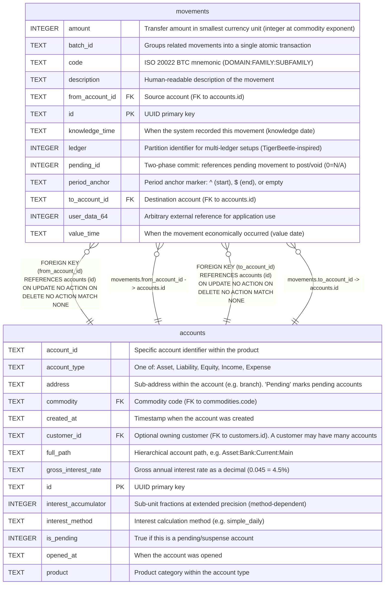

# movements

## Description

Core transaction records. Each movement transfers an integer amount from one account to another. Movements with the same batch_id form a linked transaction (compound entry). Inspired by TigerBeetle's transfer model with code, ledger, and pending_id fields.  


<details>
<summary><strong>Table Definition</strong></summary>

```sql
CREATE TABLE movements (
    id TEXT PRIMARY KEY,
    batch_id TEXT NOT NULL,
    from_account_id TEXT NOT NULL REFERENCES accounts(id),
    to_account_id TEXT NOT NULL REFERENCES accounts(id),
    amount INTEGER NOT NULL,
    code TEXT NOT NULL,
    ledger INTEGER NOT NULL DEFAULT 0,
    pending_id INTEGER NOT NULL DEFAULT 0,
    user_data_64 INTEGER NOT NULL DEFAULT 0,
    value_time TEXT NOT NULL,
    knowledge_time TEXT DEFAULT (datetime('now')),
    description TEXT NOT NULL DEFAULT '',
    period_anchor TEXT NOT NULL DEFAULT ''
)
```

</details>

## Columns

| Name            | Type    | Default         | Nullable | Children | Parents                 | Comment                                                                   |
| --------------- | ------- | --------------- | -------- | -------- | ----------------------- | ------------------------------------------------------------------------- |
| amount          | INTEGER |                 | false    |          |                         | Transfer amount in smallest currency unit (integer at commodity exponent) |
| batch_id        | TEXT    |                 | false    |          |                         | Groups related movements into a single atomic transaction                 |
| code            | TEXT    |                 | false    |          |                         | ISO 20022 BTC mnemonic (DOMAIN:FAMILY:SUBFAMILY)                          |
| description     | TEXT    | ''              | false    |          |                         | Human-readable description of the movement                                |
| from_account_id | TEXT    |                 | false    |          | [accounts](accounts.md) | Source account (FK to accounts.id)                                        |
| id              | TEXT    |                 | true     |          |                         | UUID primary key                                                          |
| knowledge_time  | TEXT    | datetime('now') | true     |          |                         | When the system recorded this movement (knowledge date)                   |
| ledger          | INTEGER | 0               | false    |          |                         | Partition identifier for multi-ledger setups (TigerBeetle-inspired)       |
| pending_id      | INTEGER | 0               | false    |          |                         | Two-phase commit: references pending movement to post/void (0=N/A)        |
| period_anchor   | TEXT    | ''              | false    |          |                         | Period anchor marker: ^ (start), $ (end), or empty                        |
| to_account_id   | TEXT    |                 | false    |          | [accounts](accounts.md) | Destination account (FK to accounts.id)                                   |
| user_data_64    | INTEGER | 0               | false    |          |                         | Arbitrary external reference for application use                          |
| value_time      | TEXT    |                 | false    |          |                         | When the movement economically occurred (value date)                      |

## Constraints

| Name                         | Type        | Definition                                                                                                |
| ---------------------------- | ----------- | --------------------------------------------------------------------------------------------------------- |
| - (Foreign key ID: 0)        | FOREIGN KEY | FOREIGN KEY (to_account_id) REFERENCES accounts (id) ON UPDATE NO ACTION ON DELETE NO ACTION MATCH NONE   |
| - (Foreign key ID: 1)        | FOREIGN KEY | FOREIGN KEY (from_account_id) REFERENCES accounts (id) ON UPDATE NO ACTION ON DELETE NO ACTION MATCH NONE |
| id                           | PRIMARY KEY | PRIMARY KEY (id)                                                                                          |
| sqlite_autoindex_movements_1 | PRIMARY KEY | PRIMARY KEY (id)                                                                                          |

## Indexes

| Name                         | Definition                                                                    |
| ---------------------------- | ----------------------------------------------------------------------------- |
| idx_movements_batch          | CREATE INDEX idx_movements_batch ON movements(batch_id)                       |
| idx_movements_code           | CREATE INDEX idx_movements_code ON movements(to_account_id, code, value_time) |
| idx_movements_from           | CREATE INDEX idx_movements_from ON movements(from_account_id, value_time)     |
| idx_movements_to             | CREATE INDEX idx_movements_to ON movements(to_account_id, value_time)         |
| sqlite_autoindex_movements_1 | PRIMARY KEY (id)                                                              |

## Relations



---

> Generated by [tbls](https://github.com/k1LoW/tbls)
