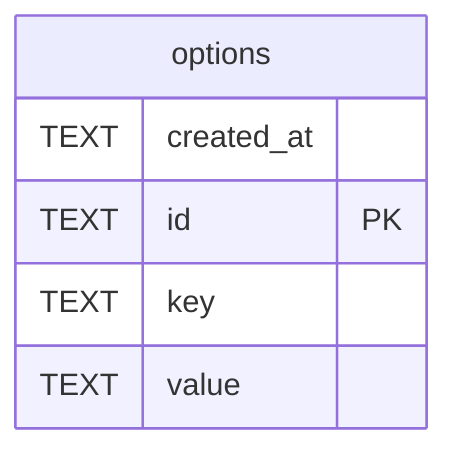

# options

## Description

<details>
<summary><strong>Table Definition</strong></summary>

```sql
CREATE TABLE options (
    id TEXT PRIMARY KEY,
    key TEXT NOT NULL UNIQUE,
    value TEXT NOT NULL DEFAULT '',
    created_at TEXT DEFAULT (datetime('now'))
)
```

</details>

## Columns

| Name       | Type | Default         | Nullable | Children | Parents | Comment |
| ---------- | ---- | --------------- | -------- | -------- | ------- | ------- |
| created_at | TEXT | datetime('now') | true     |          |         |         |
| id         | TEXT |                 | true     |          |         |         |
| key        | TEXT |                 | false    |          |         |         |
| value      | TEXT | ''              | false    |          |         |         |

## Constraints

| Name                       | Type        | Definition       |
| -------------------------- | ----------- | ---------------- |
| id                         | PRIMARY KEY | PRIMARY KEY (id) |
| sqlite_autoindex_options_1 | PRIMARY KEY | PRIMARY KEY (id) |
| sqlite_autoindex_options_2 | UNIQUE      | UNIQUE (key)     |

## Indexes

| Name                       | Definition       |
| -------------------------- | ---------------- |
| sqlite_autoindex_options_1 | PRIMARY KEY (id) |
| sqlite_autoindex_options_2 | UNIQUE (key)     |

## Relations



---

> Generated by [tbls](https://github.com/k1LoW/tbls)
