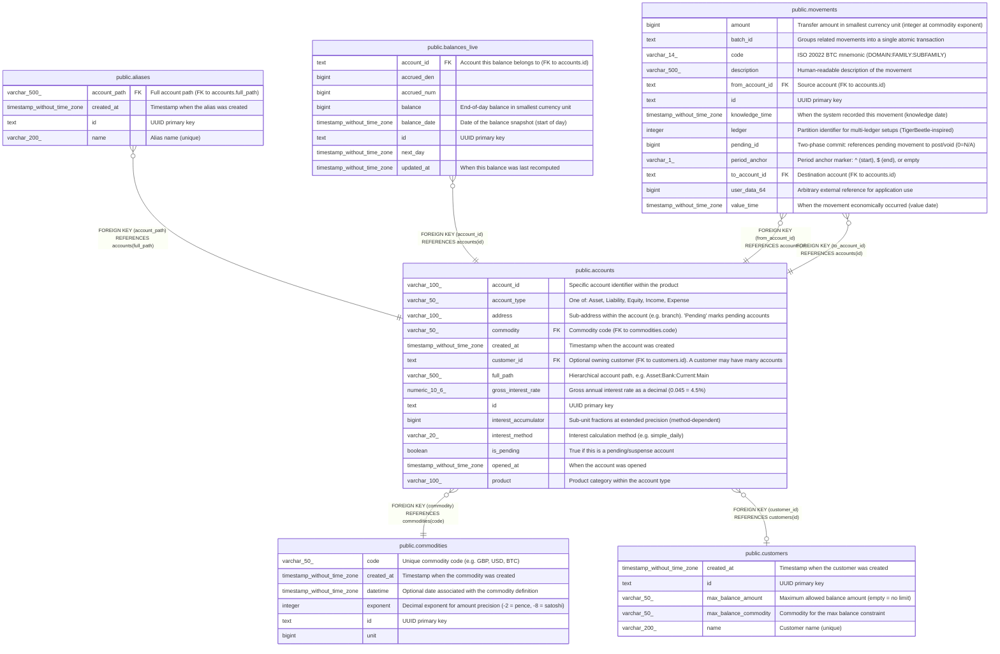

# public.accounts

## Description

Chart of accounts. Each account has a hierarchical path (Type:Product:AccountID:Address) and belongs to one of five fundamental types: Asset, Liability, Equity, Income, Expense. An account optionally belongs to a customer (many accounts per customer). Amounts are stored as integers at the precision defined by the commodity's exponent.  

## Columns

| Name                 | Type                        | Default                  | Nullable | Children                                                                                | Parents                                     | Comment                                                                          |
| -------------------- | --------------------------- | ------------------------ | -------- | --------------------------------------------------------------------------------------- | ------------------------------------------- | -------------------------------------------------------------------------------- |
| account_id           | varchar(100)                | ''::character varying    | false    |                                                                                         |                                             | Specific account identifier within the product                                   |
| account_type         | varchar(50)                 |                          | false    |                                                                                         |                                             | One of: Asset, Liability, Equity, Income, Expense                                |
| address              | varchar(100)                | ''::character varying    | false    |                                                                                         |                                             | Sub-address within the account (e.g. branch). 'Pending' marks pending accounts   |
| commodity            | varchar(50)                 | 'GBP'::character varying | false    |                                                                                         | [public.commodities](public.commodities.md) | Commodity code (FK to commodities.code)                                          |
| created_at           | timestamp without time zone | now()                    | true     |                                                                                         |                                             | Timestamp when the account was created                                           |
| customer_id          | text                        |                          | true     |                                                                                         | [public.customers](public.customers.md)     | Optional owning customer (FK to customers.id). A customer may have many accounts |
| full_path            | varchar(500)                |                          | false    | [public.aliases](public.aliases.md)                                                     |                                             | Hierarchical account path, e.g. Asset:Bank:Current:Main                          |
| gross_interest_rate  | numeric(10,6)               | 0                        | false    |                                                                                         |                                             | Gross annual interest rate as a decimal (0.045 = 4.5%)                           |
| id                   | text                        |                          | false    | [public.balances_live](public.balances_live.md) [public.movements](public.movements.md) |                                             | UUID primary key                                                                 |
| interest_accumulator | bigint                      | 0                        | false    |                                                                                         |                                             | Sub-unit fractions at extended precision (method-dependent)                      |
| interest_method      | varchar(20)                 | ''::character varying    | false    |                                                                                         |                                             | Interest calculation method (e.g. simple_daily)                                  |
| is_pending           | boolean                     | false                    | true     |                                                                                         |                                             | True if this is a pending/suspense account                                       |
| opened_at            | timestamp without time zone |                          | true     |                                                                                         |                                             | When the account was opened                                                      |
| product              | varchar(100)                | ''::character varying    | false    |                                                                                         |                                             | Product category within the account type                                         |

## Constraints

| Name                      | Type        | Definition                                           |
| ------------------------- | ----------- | ---------------------------------------------------- |
| accounts_commodity_fkey   | FOREIGN KEY | FOREIGN KEY (commodity) REFERENCES commodities(code) |
| accounts_customer_id_fkey | FOREIGN KEY | FOREIGN KEY (customer_id) REFERENCES customers(id)   |
| accounts_full_path_key    | UNIQUE      | UNIQUE (full_path)                                   |
| accounts_pkey             | PRIMARY KEY | PRIMARY KEY (id)                                     |

## Indexes

| Name                   | Definition                                                                            |
| ---------------------- | ------------------------------------------------------------------------------------- |
| accounts_full_path_key | CREATE UNIQUE INDEX accounts_full_path_key ON public.accounts USING btree (full_path) |
| accounts_pkey          | CREATE UNIQUE INDEX accounts_pkey ON public.accounts USING btree (id)                 |

## Relations

---

> Generated by [tbls](https://github.com/k1LoW/tbls)
