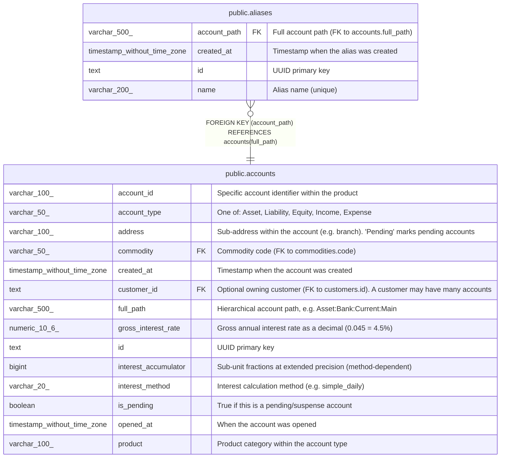

# public.aliases

## Description

Short name aliases for account paths. Allows .goluca files and users to reference accounts by a short name instead of the full hierarchical path.  

## Columns

| Name         | Type                        | Default | Nullable | Children | Parents                               | Comment                                      |
| ------------ | --------------------------- | ------- | -------- | -------- | ------------------------------------- | -------------------------------------------- |
| account_path | varchar(500)                |         | false    |          | [public.accounts](public.accounts.md) | Full account path (FK to accounts.full_path) |
| created_at   | timestamp without time zone | now()   | true     |          |                                       | Timestamp when the alias was created         |
| id           | text                        |         | false    |          |                                       | UUID primary key                             |
| name         | varchar(200)                |         | false    |          |                                       | Alias name (unique)                          |

## Constraints

| Name                      | Type        | Definition                                                |
| ------------------------- | ----------- | --------------------------------------------------------- |
| aliases_account_path_fkey | FOREIGN KEY | FOREIGN KEY (account_path) REFERENCES accounts(full_path) |
| aliases_name_key          | UNIQUE      | UNIQUE (name)                                             |
| aliases_pkey              | PRIMARY KEY | PRIMARY KEY (id)                                          |

## Indexes

| Name             | Definition                                                                |
| ---------------- | ------------------------------------------------------------------------- |
| aliases_name_key | CREATE UNIQUE INDEX aliases_name_key ON public.aliases USING btree (name) |
| aliases_pkey     | CREATE UNIQUE INDEX aliases_pkey ON public.aliases USING btree (id)       |

## Relations

---

> Generated by [tbls](https://github.com/k1LoW/tbls)
