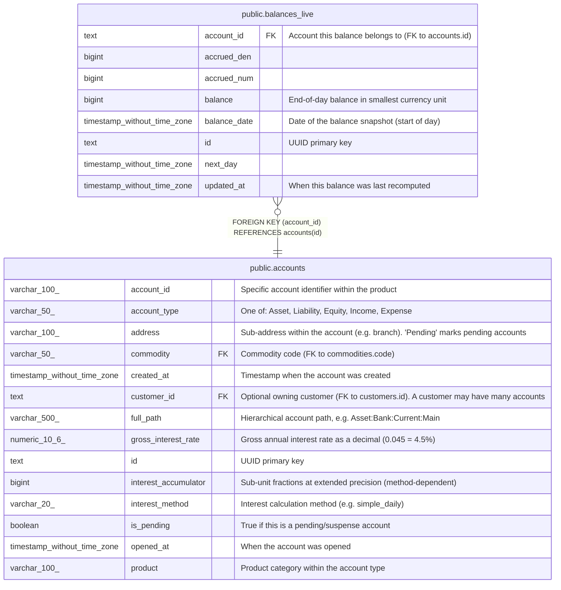

# public.balances_live

## Description

Pre-computed end-of-day balance snapshots for today and tomorrow only. Holds at most two days of balances per account — older entries are pruned. Updated transactionally when movements are recorded via RecordMovementWithProjections. Avoids expensive SUM queries for frequently accessed current and projected balances.  

## Columns

| Name         | Type                        | Default | Nullable | Children | Parents                               | Comment                                             |
| ------------ | --------------------------- | ------- | -------- | -------- | ------------------------------------- | --------------------------------------------------- |
| account_id   | text                        |         | false    |          | [public.accounts](public.accounts.md) | Account this balance belongs to (FK to accounts.id) |
| accrued_den  | bigint                      | 1       | false    |          |                                       |                                                     |
| accrued_num  | bigint                      | 0       | false    |          |                                       |                                                     |
| balance      | bigint                      |         | false    |          |                                       | End-of-day balance in smallest currency unit        |
| balance_date | timestamp without time zone |         | false    |          |                                       | Date of the balance snapshot (start of day)         |
| id           | text                        |         | false    |          |                                       | UUID primary key                                    |
| next_day     | timestamp without time zone |         | true     |          |                                       |                                                     |
| updated_at   | timestamp without time zone | now()   | true     |          |                                       | When this balance was last recomputed               |

## Constraints

| Name                          | Type        | Definition                                       |
| ----------------------------- | ----------- | ------------------------------------------------ |
| balances_live_account_id_fkey | FOREIGN KEY | FOREIGN KEY (account_id) REFERENCES accounts(id) |
| balances_live_pkey            | PRIMARY KEY | PRIMARY KEY (id)                                 |

## Indexes

| Name                     | Definition                                                                                                  |
| ------------------------ | ----------------------------------------------------------------------------------------------------------- |
| balances_live_pkey       | CREATE UNIQUE INDEX balances_live_pkey ON public.balances_live USING btree (id)                             |
| idx_balances_live_unique | CREATE UNIQUE INDEX idx_balances_live_unique ON public.balances_live USING btree (account_id, balance_date) |

## Relations

---

> Generated by [tbls](https://github.com/k1LoW/tbls)
