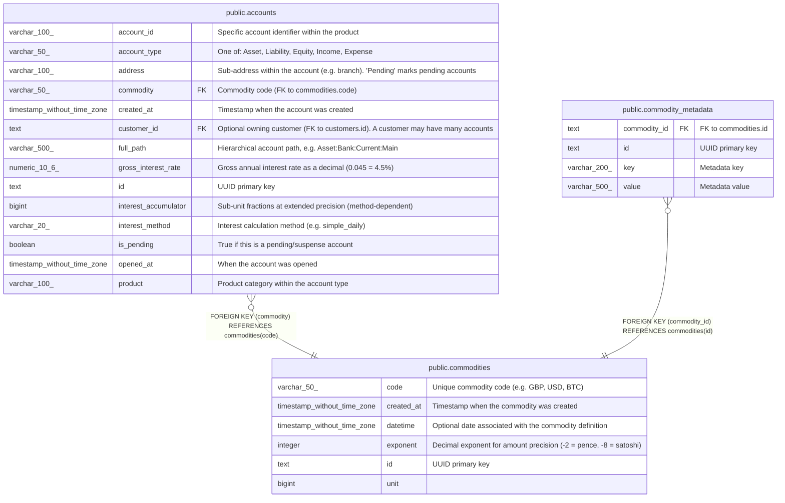

# public.commodities

## Description

Currency/commodity definitions. Each commodity has a unique code and an exponent that defines the precision of amounts (e.g. -2 for pence). Accounts reference commodities via foreign key.  

## Columns

| Name       | Type                        | Default       | Nullable | Children                                                  | Parents | Comment                                                          |
| ---------- | --------------------------- | ------------- | -------- | --------------------------------------------------------- | ------- | ---------------------------------------------------------------- |
| code       | varchar(50)                 |               | false    | [public.accounts](public.accounts.md)                     |         | Unique commodity code (e.g. GBP, USD, BTC)                       |
| created_at | timestamp without time zone | now()         | true     |                                                           |         | Timestamp when the commodity was created                         |
| datetime   | timestamp without time zone |               | true     |                                                           |         | Optional date associated with the commodity definition           |
| exponent   | integer                     | '-2'::integer | false    |                                                           |         | Decimal exponent for amount precision (-2 = pence, -8 = satoshi) |
| id         | text                        |               | false    | [public.commodity_metadata](public.commodity_metadata.md) |         | UUID primary key                                                 |
| unit       | bigint                      | 0             | false    |                                                           |         |                                                                  |

## Constraints

| Name                 | Type        | Definition       |
| -------------------- | ----------- | ---------------- |
| commodities_code_key | UNIQUE      | UNIQUE (code)    |
| commodities_pkey     | PRIMARY KEY | PRIMARY KEY (id) |

## Indexes

| Name                 | Definition                                                                        |
| -------------------- | --------------------------------------------------------------------------------- |
| commodities_code_key | CREATE UNIQUE INDEX commodities_code_key ON public.commodities USING btree (code) |
| commodities_pkey     | CREATE UNIQUE INDEX commodities_pkey ON public.commodities USING btree (id)       |

## Relations

---

> Generated by [tbls](https://github.com/k1LoW/tbls)
