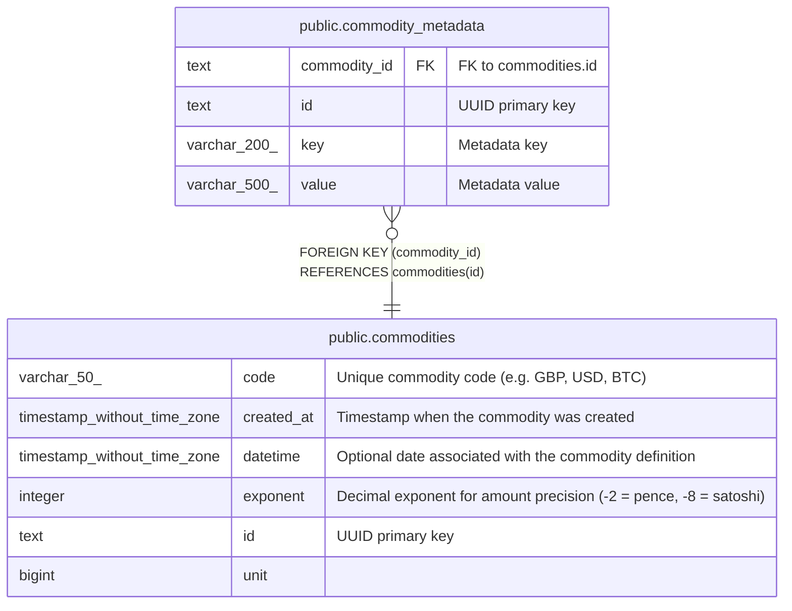

# public.commodity_metadata

## Description

Key-value metadata for commodities.

## Columns

| Name         | Type         | Default               | Nullable | Children | Parents                                     | Comment              |
| ------------ | ------------ | --------------------- | -------- | -------- | ------------------------------------------- | -------------------- |
| commodity_id | text         |                       | false    |          | [public.commodities](public.commodities.md) | FK to commodities.id |
| id           | text         |                       | false    |          |                                             | UUID primary key     |
| key          | varchar(200) |                       | false    |          |                                             | Metadata key         |
| value        | varchar(500) | ''::character varying | false    |          |                                             | Metadata value       |

## Constraints

| Name                                 | Type        | Definition                                            |
| ------------------------------------ | ----------- | ----------------------------------------------------- |
| commodity_metadata_commodity_id_fkey | FOREIGN KEY | FOREIGN KEY (commodity_id) REFERENCES commodities(id) |
| commodity_metadata_pkey              | PRIMARY KEY | PRIMARY KEY (id)                                      |

## Indexes

| Name                          | Definition                                                                                                     |
| ----------------------------- | -------------------------------------------------------------------------------------------------------------- |
| commodity_metadata_pkey       | CREATE UNIQUE INDEX commodity_metadata_pkey ON public.commodity_metadata USING btree (id)                      |
| idx_commodity_metadata_unique | CREATE UNIQUE INDEX idx_commodity_metadata_unique ON public.commodity_metadata USING btree (commodity_id, key) |

## Relations

---

> Generated by [tbls](https://github.com/k1LoW/tbls)
