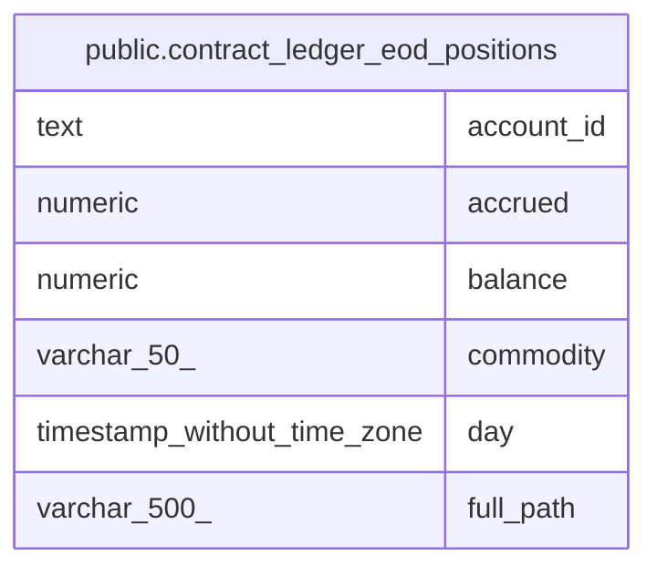

# public.contract_ledger_eod_positions

## Description

<details>
<summary><strong>Table Definition</strong></summary>

```sql
CREATE VIEW contract_ledger_eod_positions AS (
 SELECT p.account_id,
    a.full_path,
    a.commodity,
    p.balance_date AS day,
    round(((p.balance)::numeric / (c.unit)::numeric), (- c.exponent)) AS balance,
    round((((p.accrued_num)::numeric / (p.accrued_den)::numeric) / (c.unit)::numeric), 7) AS accrued
   FROM ((balances_live p
     JOIN accounts a ON ((a.id = p.account_id)))
     JOIN commodities c ON (((c.code)::text = (a.commodity)::text)))
)
```

</details>

## Columns

| Name       | Type                        | Default | Nullable | Children | Parents | Comment |
| ---------- | --------------------------- | ------- | -------- | -------- | ------- | ------- |
| account_id | text                        |         | true     |          |         |         |
| accrued    | numeric                     |         | true     |          |         |         |
| balance    | numeric                     |         | true     |          |         |         |
| commodity  | varchar(50)                 |         | true     |          |         |         |
| day        | timestamp without time zone |         | true     |          |         |         |
| full_path  | varchar(500)                |         | true     |          |         |         |

## Referenced Tables

| Name                                            | Columns | Comment                                                                                                                                                                                                                                                                                                                                                | Type       |
| ----------------------------------------------- | ------- | ------------------------------------------------------------------------------------------------------------------------------------------------------------------------------------------------------------------------------------------------------------------------------------------------------------------------------------------------------ | ---------- |
| [public.balances_live](public.balances_live.md) | 8       | Pre-computed end-of-day balance snapshots for today and tomorrow only. Holds at most two days of balances per account — older entries are pruned. Updated transactionally when movements are recorded via RecordMovementWithProjections. Avoids expensive SUM queries for frequently accessed current and projected balances.<br />                    | BASE TABLE |
| [public.accounts](public.accounts.md)           | 14      | Chart of accounts. Each account has a hierarchical path (Type:Product:AccountID:Address) and belongs to one of five fundamental types: Asset, Liability, Equity, Income, Expense. An account optionally belongs to a customer (many accounts per customer). Amounts are stored as integers at the precision defined by the commodity's exponent.<br /> | BASE TABLE |
| [public.commodities](public.commodities.md)     | 6       | Currency/commodity definitions. Each commodity has a unique code and an exponent that defines the precision of amounts (e.g. -2 for pence). Accounts reference commodities via foreign key.<br />                                                                                                                                                      | BASE TABLE |

## Relations



---

> Generated by [tbls](https://github.com/k1LoW/tbls)
