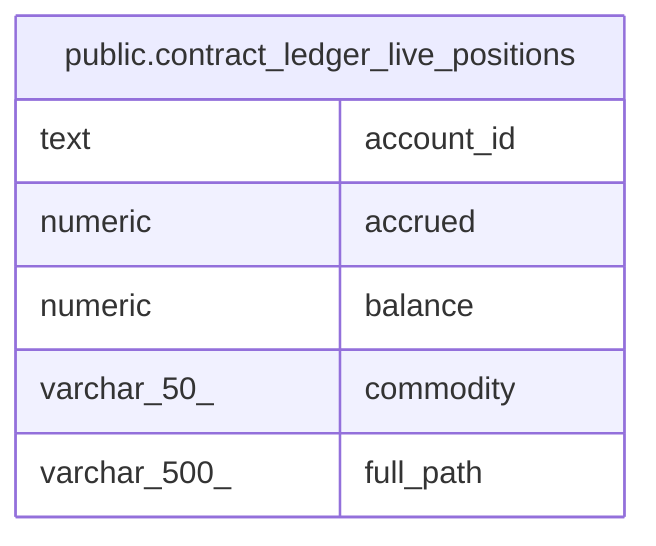

# public.contract_ledger_live_positions

## Description

<details>
<summary><strong>Table Definition</strong></summary>

```sql
CREATE VIEW contract_ledger_live_positions AS (
 SELECT account_id,
    full_path,
    commodity,
    round((balance_minor / (unit)::numeric), (- exponent)) AS balance,
    round((((accrued_num)::numeric / (accrued_den)::numeric) / (unit)::numeric), 7) AS accrued
   FROM ( SELECT l.account_id,
            l.full_path,
            l.commodity,
            l.unit,
            l.exponent,
            l.accrued_num,
            l.accrued_den,
            (((l.balance)::numeric + COALESCE(( SELECT sum(m.amount) AS sum
                   FROM movements m
                  WHERE ((m.to_account_id = l.account_id) AND (m.value_time >= l.next_day))), (0)::numeric)) - COALESCE(( SELECT sum(m.amount) AS sum
                   FROM movements m
                  WHERE ((m.from_account_id = l.account_id) AND (m.value_time >= l.next_day))), (0)::numeric)) AS balance_minor
           FROM ( SELECT a.id AS account_id,
                    a.full_path,
                    a.commodity,
                    c.unit,
                    c.exponent,
                    COALESCE(p.balance, y.balance, ( SELECT z.balance
                           FROM balances_live z
                          WHERE (z.account_id = a.id)
                          ORDER BY z.balance_date DESC
                         LIMIT 1), (0)::bigint) AS balance,
                    COALESCE(p.next_day, y.next_day, ( SELECT z.next_day
                           FROM balances_live z
                          WHERE (z.account_id = a.id)
                          ORDER BY z.balance_date DESC
                         LIMIT 1), '0001-01-01 00:00:00'::timestamp without time zone) AS next_day,
                    COALESCE(p.accrued_num, y.accrued_num, ( SELECT z.accrued_num
                           FROM balances_live z
                          WHERE (z.account_id = a.id)
                          ORDER BY z.balance_date DESC
                         LIMIT 1), (0)::bigint) AS accrued_num,
                    COALESCE(p.accrued_den, y.accrued_den, ( SELECT z.accrued_den
                           FROM balances_live z
                          WHERE (z.account_id = a.id)
                          ORDER BY z.balance_date DESC
                         LIMIT 1), (1)::bigint) AS accrued_den
                   FROM (((accounts a
                     JOIN commodities c ON (((c.code)::text = (a.commodity)::text)))
                     LEFT JOIN balances_live p ON (((p.account_id = a.id) AND (p.balance_date = ( SELECT ledger_day.day
                           FROM ledger_day)))))
                     LEFT JOIN balances_live y ON (((y.account_id = a.id) AND (y.balance_date = ( SELECT ledger_day.prev_day
                           FROM ledger_day)))))) l) b
)
```

</details>

## Columns

| Name       | Type         | Default | Nullable | Children | Parents | Comment |
| ---------- | ------------ | ------- | -------- | -------- | ------- | ------- |
| account_id | text         |         | true     |          |         |         |
| accrued    | numeric      |         | true     |          |         |         |
| balance    | numeric      |         | true     |          |         |         |
| commodity  | varchar(50)  |         | true     |          |         |         |
| full_path  | varchar(500) |         | true     |          |         |         |

## Referenced Tables

| Name                                            | Columns | Comment                                                                                                                                                                                                                                                                                                                                                | Type       |
| ----------------------------------------------- | ------- | ------------------------------------------------------------------------------------------------------------------------------------------------------------------------------------------------------------------------------------------------------------------------------------------------------------------------------------------------------ | ---------- |
| [public.movements](public.movements.md)         | 13      | Core transaction records. Each movement transfers an integer amount from one account to another. Movements with the same batch_id form a linked transaction (compound entry). Inspired by TigerBeetle's transfer model with code, ledger, and pending_id fields.<br />                                                                                 | BASE TABLE |
| [public.balances_live](public.balances_live.md) | 8       | Pre-computed end-of-day balance snapshots for today and tomorrow only. Holds at most two days of balances per account — older entries are pruned. Updated transactionally when movements are recorded via RecordMovementWithProjections. Avoids expensive SUM queries for frequently accessed current and projected balances.<br />                    | BASE TABLE |
| [public.accounts](public.accounts.md)           | 14      | Chart of accounts. Each account has a hierarchical path (Type:Product:AccountID:Address) and belongs to one of five fundamental types: Asset, Liability, Equity, Income, Expense. An account optionally belongs to a customer (many accounts per customer). Amounts are stored as integers at the precision defined by the commodity's exponent.<br /> | BASE TABLE |
| [public.commodities](public.commodities.md)     | 6       | Currency/commodity definitions. Each commodity has a unique code and an exponent that defines the precision of amounts (e.g. -2 for pence). Accounts reference commodities via foreign key.<br />                                                                                                                                                      | BASE TABLE |
| [public.ledger_day](public.ledger_day.md)       | 2       |                                                                                                                                                                                                                                                                                                                                                        | BASE TABLE |

## Relations



---

> Generated by [tbls](https://github.com/k1LoW/tbls)
