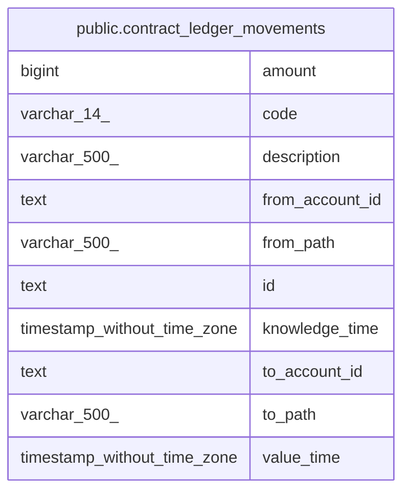

# public.contract_ledger_movements

## Description

<details>
<summary><strong>Table Definition</strong></summary>

```sql
CREATE VIEW contract_ledger_movements AS (
 SELECT m.id,
    m.from_account_id,
    m.to_account_id,
    fa.full_path AS from_path,
    ta.full_path AS to_path,
    m.amount,
    m.code,
    m.value_time,
    m.knowledge_time,
    m.description
   FROM ((movements m
     JOIN accounts fa ON ((fa.id = m.from_account_id)))
     JOIN accounts ta ON ((ta.id = m.to_account_id)))
)
```

</details>

## Columns

| Name            | Type                        | Default | Nullable | Children | Parents | Comment |
| --------------- | --------------------------- | ------- | -------- | -------- | ------- | ------- |
| amount          | bigint                      |         | true     |          |         |         |
| code            | varchar(14)                 |         | true     |          |         |         |
| description     | varchar(500)                |         | true     |          |         |         |
| from_account_id | text                        |         | true     |          |         |         |
| from_path       | varchar(500)                |         | true     |          |         |         |
| id              | text                        |         | true     |          |         |         |
| knowledge_time  | timestamp without time zone |         | true     |          |         |         |
| to_account_id   | text                        |         | true     |          |         |         |
| to_path         | varchar(500)                |         | true     |          |         |         |
| value_time      | timestamp without time zone |         | true     |          |         |         |

## Referenced Tables

| Name                                    | Columns | Comment                                                                                                                                                                                                                                                                                                                                                | Type       |
| --------------------------------------- | ------- | ------------------------------------------------------------------------------------------------------------------------------------------------------------------------------------------------------------------------------------------------------------------------------------------------------------------------------------------------------ | ---------- |
| [public.movements](public.movements.md) | 13      | Core transaction records. Each movement transfers an integer amount from one account to another. Movements with the same batch_id form a linked transaction (compound entry). Inspired by TigerBeetle's transfer model with code, ledger, and pending_id fields.<br />                                                                                 | BASE TABLE |
| [public.accounts](public.accounts.md)   | 14      | Chart of accounts. Each account has a hierarchical path (Type:Product:AccountID:Address) and belongs to one of five fundamental types: Asset, Liability, Equity, Income, Expense. An account optionally belongs to a customer (many accounts per customer). Amounts are stored as integers at the precision defined by the commodity's exponent.<br /> | BASE TABLE |

## Relations



---

> Generated by [tbls](https://github.com/k1LoW/tbls)
