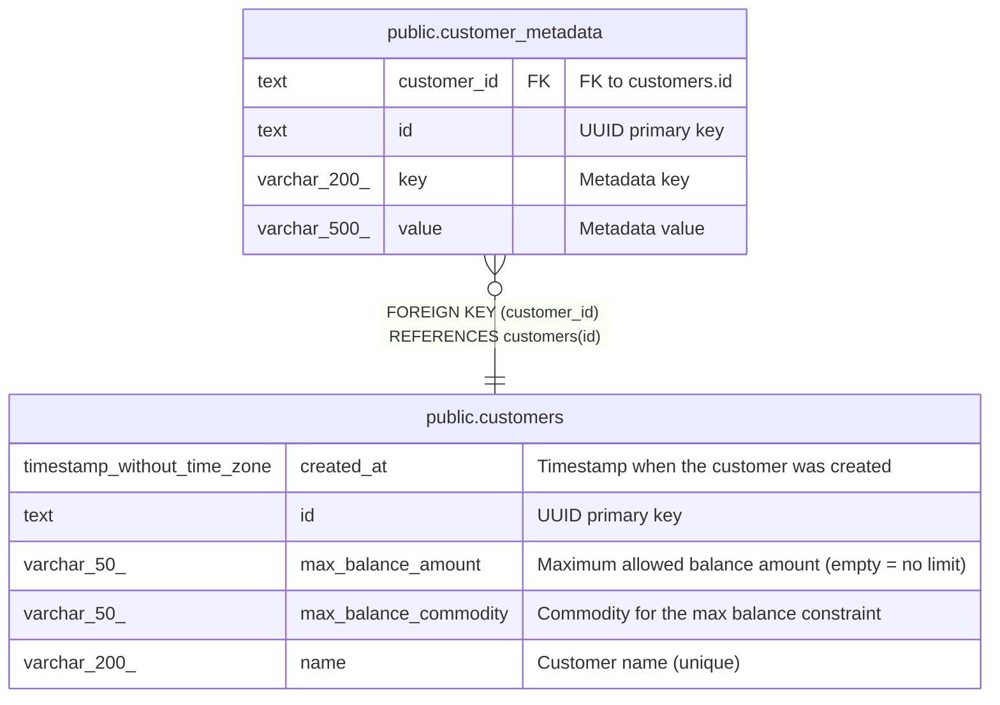

# public.customer_metadata

## Description

Key-value metadata for customers.

## Columns

| Name        | Type         | Default               | Nullable | Children | Parents                                 | Comment            |
| ----------- | ------------ | --------------------- | -------- | -------- | --------------------------------------- | ------------------ |
| customer_id | text         |                       | false    |          | [public.customers](public.customers.md) | FK to customers.id |
| id          | text         |                       | false    |          |                                         | UUID primary key   |
| key         | varchar(200) |                       | false    |          |                                         | Metadata key       |
| value       | varchar(500) | ''::character varying | false    |          |                                         | Metadata value     |

## Constraints

| Name                               | Type        | Definition                                         |
| ---------------------------------- | ----------- | -------------------------------------------------- |
| customer_metadata_customer_id_fkey | FOREIGN KEY | FOREIGN KEY (customer_id) REFERENCES customers(id) |
| customer_metadata_pkey             | PRIMARY KEY | PRIMARY KEY (id)                                   |

## Indexes

| Name                         | Definition                                                                                                  |
| ---------------------------- | ----------------------------------------------------------------------------------------------------------- |
| customer_metadata_pkey       | CREATE UNIQUE INDEX customer_metadata_pkey ON public.customer_metadata USING btree (id)                     |
| idx_customer_metadata_unique | CREATE UNIQUE INDEX idx_customer_metadata_unique ON public.customer_metadata USING btree (customer_id, key) |

## Relations

---

> Generated by [tbls](https://github.com/k1LoW/tbls)
