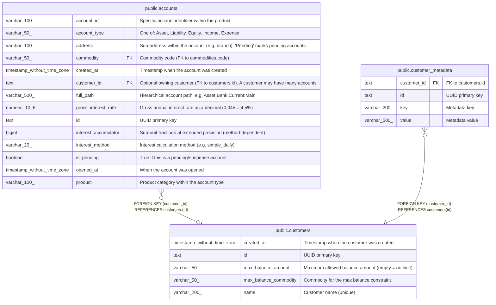

# public.customers

## Description

Customer records. A customer may have zero to many accounts (via accounts.customer_id). Supports max balance constraints and arbitrary key-value metadata.  

## Columns

| Name                  | Type                        | Default               | Nullable | Children                                                                                      | Parents | Comment                                           |
| --------------------- | --------------------------- | --------------------- | -------- | --------------------------------------------------------------------------------------------- | ------- | ------------------------------------------------- |
| created_at            | timestamp without time zone | now()                 | true     |                                                                                               |         | Timestamp when the customer was created           |
| id                    | text                        |                       | false    | [public.accounts](public.accounts.md) [public.customer_metadata](public.customer_metadata.md) |         | UUID primary key                                  |
| max_balance_amount    | varchar(50)                 | ''::character varying | false    |                                                                                               |         | Maximum allowed balance amount (empty = no limit) |
| max_balance_commodity | varchar(50)                 | ''::character varying | false    |                                                                                               |         | Commodity for the max balance constraint          |
| name                  | varchar(200)                |                       | false    |                                                                                               |         | Customer name (unique)                            |

## Constraints

| Name               | Type        | Definition       |
| ------------------ | ----------- | ---------------- |
| customers_name_key | UNIQUE      | UNIQUE (name)    |
| customers_pkey     | PRIMARY KEY | PRIMARY KEY (id) |

## Indexes

| Name               | Definition                                                                    |
| ------------------ | ----------------------------------------------------------------------------- |
| customers_name_key | CREATE UNIQUE INDEX customers_name_key ON public.customers USING btree (name) |
| customers_pkey     | CREATE UNIQUE INDEX customers_pkey ON public.customers USING btree (id)       |

## Relations

---

> Generated by [tbls](https://github.com/k1LoW/tbls)
