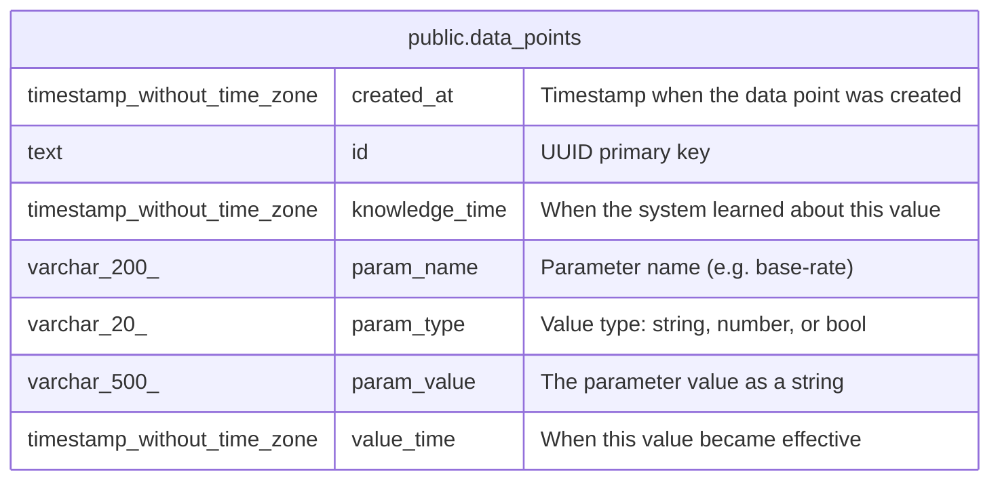

# public.data_points

## Description

Time-series parameter values. Stores named data points with value and knowledge timestamps for bitemporal queries (e.g. interest rate changes, exchange rates).  

## Columns

| Name           | Type                        | Default                     | Nullable | Children | Parents | Comment                                   |
| -------------- | --------------------------- | --------------------------- | -------- | -------- | ------- | ----------------------------------------- |
| created_at     | timestamp without time zone | now()                       | true     |          |         | Timestamp when the data point was created |
| id             | text                        |                             | false    |          |         | UUID primary key                          |
| knowledge_time | timestamp without time zone | now()                       | true     |          |         | When the system learned about this value  |
| param_name     | varchar(200)                |                             | false    |          |         | Parameter name (e.g. base-rate)           |
| param_type     | varchar(20)                 | 'string'::character varying | false    |          |         | Value type: string, number, or bool       |
| param_value    | varchar(500)                | ''::character varying       | false    |          |         | The parameter value as a string           |
| value_time     | timestamp without time zone |                             | false    |          |         | When this value became effective          |

## Constraints

| Name             | Type        | Definition       |
| ---------------- | ----------- | ---------------- |
| data_points_pkey | PRIMARY KEY | PRIMARY KEY (id) |

## Indexes

| Name                      | Definition                                                                                        |
| ------------------------- | ------------------------------------------------------------------------------------------------- |
| data_points_pkey          | CREATE UNIQUE INDEX data_points_pkey ON public.data_points USING btree (id)                       |
| idx_data_points_name_time | CREATE INDEX idx_data_points_name_time ON public.data_points USING btree (param_name, value_time) |

## Relations

---

> Generated by [tbls](https://github.com/k1LoW/tbls)
