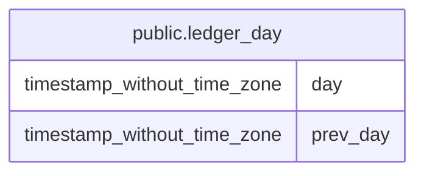

# public.ledger_day

## Columns

| Name     | Type                        | Default | Nullable | Children | Parents | Comment |
| -------- | --------------------------- | ------- | -------- | -------- | ------- | ------- |
| day      | timestamp without time zone |         | false    |          |         |         |
| prev_day | timestamp without time zone |         | true     |          |         |         |

## Relations

---

> Generated by [tbls](https://github.com/k1LoW/tbls)
