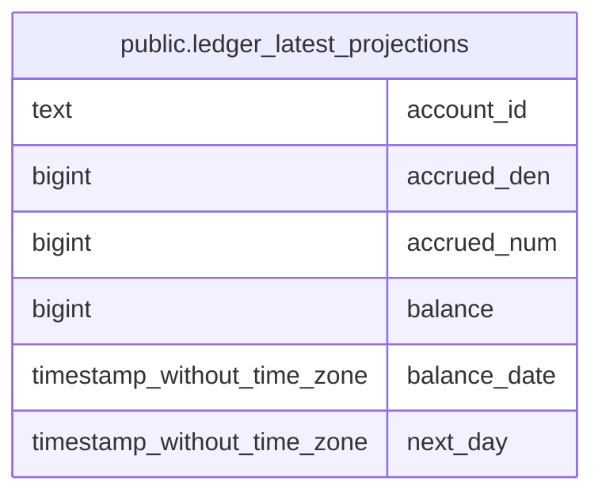

# public.ledger_latest_projections

## Description

<details>
<summary><strong>Table Definition</strong></summary>

```sql
CREATE VIEW ledger_latest_projections AS (
 SELECT p.account_id,
    p.balance_date,
    p.next_day,
    p.balance,
    p.accrued_num,
    p.accrued_den
   FROM (balances_live p
     JOIN ( SELECT balances_live.account_id,
            max(balances_live.balance_date) AS latest
           FROM balances_live
          GROUP BY balances_live.account_id) q ON (((q.account_id = p.account_id) AND (q.latest = p.balance_date))))
)
```

</details>

## Columns

| Name         | Type                        | Default | Nullable | Children | Parents | Comment |
| ------------ | --------------------------- | ------- | -------- | -------- | ------- | ------- |
| account_id   | text                        |         | true     |          |         |         |
| accrued_den  | bigint                      |         | true     |          |         |         |
| accrued_num  | bigint                      |         | true     |          |         |         |
| balance      | bigint                      |         | true     |          |         |         |
| balance_date | timestamp without time zone |         | true     |          |         |         |
| next_day     | timestamp without time zone |         | true     |          |         |         |

## Referenced Tables

| Name                                            | Columns | Comment                                                                                                                                                                                                                                                                                                                             | Type       |
| ----------------------------------------------- | ------- | ----------------------------------------------------------------------------------------------------------------------------------------------------------------------------------------------------------------------------------------------------------------------------------------------------------------------------------- | ---------- |
| [public.balances_live](public.balances_live.md) | 8       | Pre-computed end-of-day balance snapshots for today and tomorrow only. Holds at most two days of balances per account — older entries are pruned. Updated transactionally when movements are recorded via RecordMovementWithProjections. Avoids expensive SUM queries for frequently accessed current and projected balances.<br /> | BASE TABLE |

## Relations



---

> Generated by [tbls](https://github.com/k1LoW/tbls)
