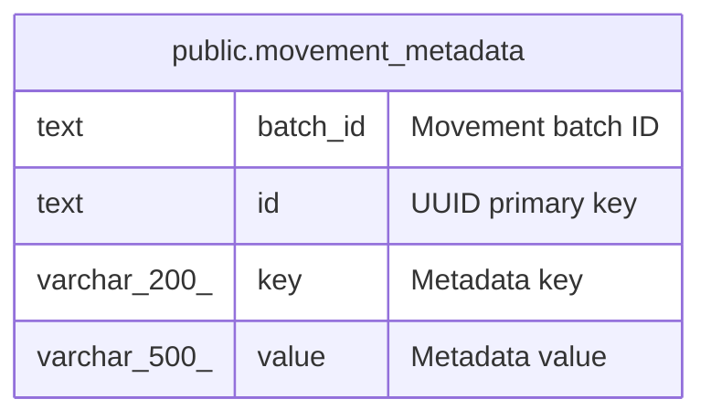

# public.movement_metadata

## Description

Key-value metadata for movement batches.

## Columns

| Name     | Type         | Default               | Nullable | Children | Parents | Comment           |
| -------- | ------------ | --------------------- | -------- | -------- | ------- | ----------------- |
| batch_id | text         |                       | false    |          |         | Movement batch ID |
| id       | text         |                       | false    |          |         | UUID primary key  |
| key      | varchar(200) |                       | false    |          |         | Metadata key      |
| value    | varchar(500) | ''::character varying | false    |          |         | Metadata value    |

## Constraints

| Name                   | Type        | Definition       |
| ---------------------- | ----------- | ---------------- |
| movement_metadata_pkey | PRIMARY KEY | PRIMARY KEY (id) |

## Indexes

| Name                         | Definition                                                                                               |
| ---------------------------- | -------------------------------------------------------------------------------------------------------- |
| idx_movement_metadata_unique | CREATE UNIQUE INDEX idx_movement_metadata_unique ON public.movement_metadata USING btree (batch_id, key) |
| movement_metadata_pkey       | CREATE UNIQUE INDEX movement_metadata_pkey ON public.movement_metadata USING btree (id)                  |

## Relations

---

> Generated by [tbls](https://github.com/k1LoW/tbls)
