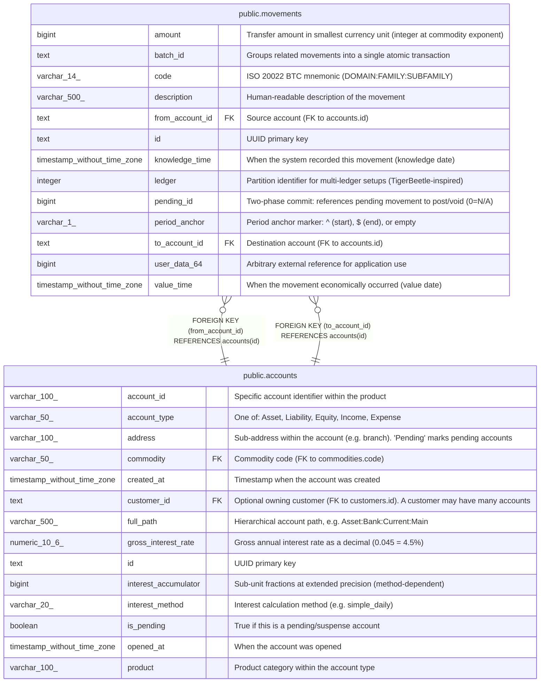

# public.movements

## Description

Core transaction records. Each movement transfers an integer amount from one account to another. Movements with the same batch_id form a linked transaction (compound entry). Inspired by TigerBeetle's transfer model with code, ledger, and pending_id fields.  

## Columns

| Name            | Type                        | Default               | Nullable | Children | Parents                               | Comment                                                                   |
| --------------- | --------------------------- | --------------------- | -------- | -------- | ------------------------------------- | ------------------------------------------------------------------------- |
| amount          | bigint                      |                       | false    |          |                                       | Transfer amount in smallest currency unit (integer at commodity exponent) |
| batch_id        | text                        |                       | false    |          |                                       | Groups related movements into a single atomic transaction                 |
| code            | varchar(14)                 |                       | false    |          |                                       | ISO 20022 BTC mnemonic (DOMAIN:FAMILY:SUBFAMILY)                          |
| description     | varchar(500)                | ''::character varying | false    |          |                                       | Human-readable description of the movement                                |
| from_account_id | text                        |                       | false    |          | [public.accounts](public.accounts.md) | Source account (FK to accounts.id)                                        |
| id              | text                        |                       | false    |          |                                       | UUID primary key                                                          |
| knowledge_time  | timestamp without time zone | now()                 | true     |          |                                       | When the system recorded this movement (knowledge date)                   |
| ledger          | integer                     | 0                     | false    |          |                                       | Partition identifier for multi-ledger setups (TigerBeetle-inspired)       |
| pending_id      | bigint                      | 0                     | false    |          |                                       | Two-phase commit: references pending movement to post/void (0=N/A)        |
| period_anchor   | varchar(1)                  | ''::character varying | false    |          |                                       | Period anchor marker: ^ (start), $ (end), or empty                        |
| to_account_id   | text                        |                       | false    |          | [public.accounts](public.accounts.md) | Destination account (FK to accounts.id)                                   |
| user_data_64    | bigint                      | 0                     | false    |          |                                       | Arbitrary external reference for application use                          |
| value_time      | timestamp without time zone |                       | false    |          |                                       | When the movement economically occurred (value date)                      |

## Constraints

| Name                           | Type        | Definition                                            |
| ------------------------------ | ----------- | ----------------------------------------------------- |
| movements_from_account_id_fkey | FOREIGN KEY | FOREIGN KEY (from_account_id) REFERENCES accounts(id) |
| movements_pkey                 | PRIMARY KEY | PRIMARY KEY (id)                                      |
| movements_to_account_id_fkey   | FOREIGN KEY | FOREIGN KEY (to_account_id) REFERENCES accounts(id)   |

## Indexes

| Name                     | Definition                                                                                        |
| ------------------------ | ------------------------------------------------------------------------------------------------- |
| idx_movements_batch      | CREATE INDEX idx_movements_batch ON public.movements USING btree (batch_id)                       |
| idx_movements_code       | CREATE INDEX idx_movements_code ON public.movements USING btree (to_account_id, code, value_time) |
| idx_movements_from       | CREATE INDEX idx_movements_from ON public.movements USING btree (from_account_id, value_time)     |
| idx_movements_to         | CREATE INDEX idx_movements_to ON public.movements USING btree (to_account_id, value_time)         |
| idx_movements_value_time | CREATE INDEX idx_movements_value_time ON public.movements USING btree (value_time)                |
| movements_pkey           | CREATE UNIQUE INDEX movements_pkey ON public.movements USING btree (id)                           |

## Relations

---

> Generated by [tbls](https://github.com/k1LoW/tbls)
