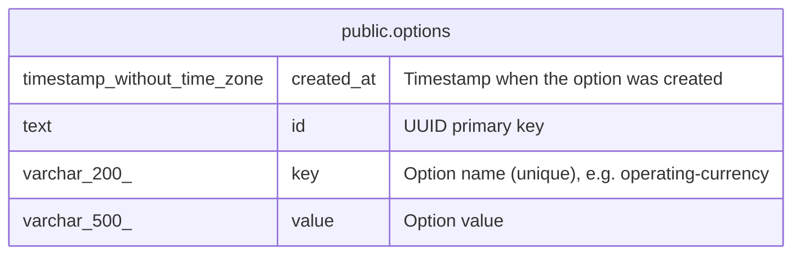

# public.options

## Description

Ledger-wide key-value configuration. Stores directives imported from .goluca files (e.g. operating-currency, require-accounts) and runtime settings.  

## Columns

| Name       | Type                        | Default               | Nullable | Children | Parents | Comment                                       |
| ---------- | --------------------------- | --------------------- | -------- | -------- | ------- | --------------------------------------------- |
| created_at | timestamp without time zone | now()                 | true     |          |         | Timestamp when the option was created         |
| id         | text                        |                       | false    |          |         | UUID primary key                              |
| key        | varchar(200)                |                       | false    |          |         | Option name (unique), e.g. operating-currency |
| value      | varchar(500)                | ''::character varying | false    |          |         | Option value                                  |

## Constraints

| Name            | Type        | Definition       |
| --------------- | ----------- | ---------------- |
| options_key_key | UNIQUE      | UNIQUE (key)     |
| options_pkey    | PRIMARY KEY | PRIMARY KEY (id) |

## Indexes

| Name            | Definition                                                              |
| --------------- | ----------------------------------------------------------------------- |
| options_key_key | CREATE UNIQUE INDEX options_key_key ON public.options USING btree (key) |
| options_pkey    | CREATE UNIQUE INDEX options_pkey ON public.options USING btree (id)     |

## Relations

---

> Generated by [tbls](https://github.com/k1LoW/tbls)
